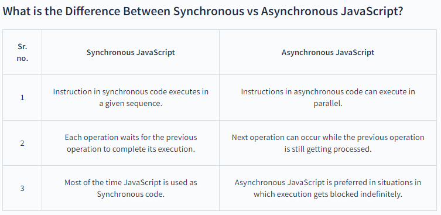
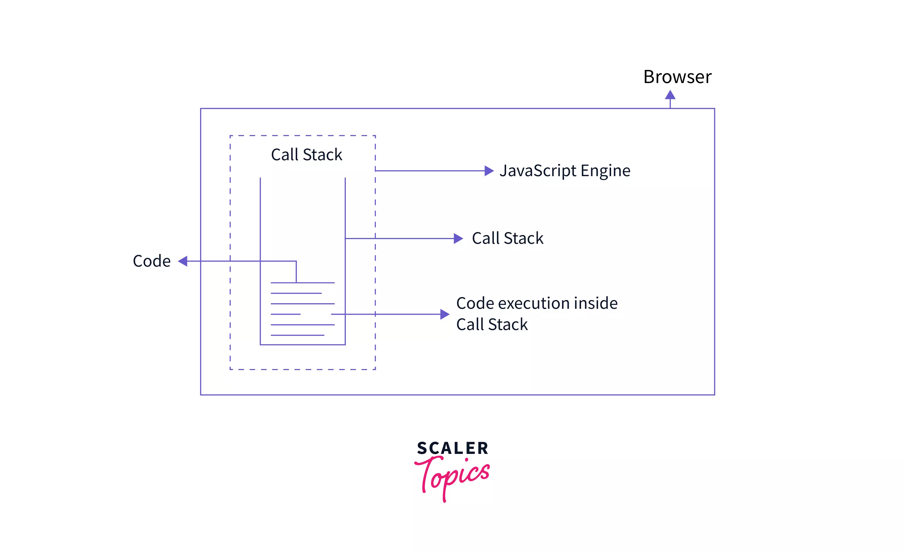

short notes :- https://www.edureka.co/blog/interview-questions/javascript-interview-questions/

Javascript Topics:

- https://www.geeksforgeeks.org/primitive-and-non-primitive-data-types-in-javascript/F
# 1. Primitives data types

src:- https://developer.mozilla.org/en-US/docs/Glossary/Primitive#:~:text=In%20JavaScript%2C%20a%20primitive%20(primitive,bigint

### ans:- In JavaScript, a primitive (primitive value, primitive data type) is data that is not an object and has no methods or properties. There are 7 primitive data types:
       1. string
       2. number
       3. bigint
       4. boolean
       5. undefined
       6. symbol
       7. null

### What is the difference between null, undefined, and NaN?

- NaN: Not a number: As the name implies, it is used to denote that the value of an object is not a number. There are many ways that you can generate this error, one being invalid math opertaions such as 0/0 or sqrt(-1)

- undefined: It means that the object doesn't have any value, therefore undefined. This occurs when you create a variable and don't assign a value to it.

- null: It means that the object is empty and isn't pointing to any memory address.

# 2. Variables, string, numbers, booleans, undefined, null, NaN

# 3. Arithmetic operators

src:- https://www.w3schools.com/js/js_arithmetic.asp

```javascript
        Operator	Description
           +	        Addition
           -	        Subtraction
           *	        Multiplication
           **	        Exponentiation (ES2016)
           /	        Division
           %	        Modulus (Remainder)
           ++	        Increment
           --	        Decrement
```

# 4. Comparison operators

```javascript
      Operator	  Description   	     Comparing    	Returns
        ==	        equal to	            x == 8	         false
                                               x == 5	         true
                                               x == "5"	         true
        whereas the === operator compares the values as well as the data types of the operands.
        ===	 equal value and equal type      x === 5	         true
                                               x === "5"	  false
        !=	       not equal	            x != 8	         true
        !==	 not equal value or not          x !== 5	         false
               equal type
                                               x !== "5"	  true
                                               x !== 8	         true
        >	greater than	                   x > 8	         false
        <	less than	                   x < 8	         true
        >=	greater than or equal to	     x >= 8	         false
        <=	less than or equal to	     x <= 8	         true
```

eg.:-

1.  undefined == null true;
2.  undefined === null false;
3.  Nan == Nan false;
4.  Nan === Nan false;
5.  [] == [] both have different memory storing address thats why false
6.  {} == {} both have different memory storing address thats why false

## Truthy

In JavaScript, a truthy value is a value that is considered true when encountered in a Boolean context. All values are truthy unless they are defined as falsy. That is, all values are truthy except false, 0, -0, 0n, "", null, undefined, and NaN.

JavaScript uses type coercion in Boolean contexts.

Examples of truthy values in JavaScript (which will be coerced to true in boolean contexts, and thus execute the if block):

```javascript
if (true)
if ({})
if ([])
if (42)
if ("0")
if ("false")
if (new Date())
if (-42)
if (12n)
if (3.14)
if (-3.14)
if (Infinity)
if (-Infinity)
```

## Falsy

A falsy value is something which evaluates to FALSE, for instance when checking a variable. There are only six falsy values in JavaScript:

1.  undefined,
2.  null,
3.  NaN,
4.  0,
5.  "" (empty string), and
6.  false of course.

EXAMPLES:-

### 5 && 2 && 0 || 2 && 3 || 15 && 21

    (T    T    F)  (T:2T:3)   (T     T)
          F      ||   T:3  ||  T:21

ANS:- 3;

### 5 && 18 && 8 || 15 && 20 && 0 || 80 && 100 && 7

ANS:- 8
in and we take last value when true and in or take first value when true

### 5 && 2 && 0 || 2 == 3 || 15 && 21

ANS:- 21

### 5 && 2 && 0 || 2 == 3

ANS:- false

# 5. Logical operators

Logical operators are used to determine the logic between variables or values.
Given that x = 6 and y = 3, the table below explains the logical operators:

```javascript
    Operator  	Description 	Example
      &&	           and	    (x < 10 && y > 1) is true
      ||	           or	    (x == 5 || y == 5) is false
      !	               not	    !(x == y) is true

```

basic examples:-

# 6. Conditional Statements (if else, switch)

```javascript
if (condition) {
  // Block of code if condition true
} else {
  // Block of code is condition false
}
```

#### Switch

In the switch statement, we compare the condition value with multiple cases. When there is a match with any one of the cases, the block of code corresponding with that case is executed. Each case has a name or a number, which is known as its identifier. If none of the cases matches the condition, the block of code corresponding to the default case is executed.

```javascript
switch (condition) {
  case identifier1:
    //block of code
    break;

  case identifier2:
    //block of code
    break;

  case identifier3:
    //block of code
    break;

  case identifiern:
    //block of code
    break;

  default:
  //block of code
}
```

src:- https://www.scaler.com/topics/c/difference-between-if-else-and-switch/

### Ternary Operator in C

src:- https://www.scaler.com/topics/c/ternary-operator-in-c/

# 7. Scope

src:- https://github.com/getify/You-Dont-Know-JS/blob/1st-ed/scope%20%26%20closures/ch5.md#nitty-gritty

Scope determines the accessibility (visibility) of variables. Scope determines the accessibility of variables, objects, and functions from different parts of the code.

- JavaScript has 3 types of scope:

1. Block scope :- Variables declared inside a { } block cannot be accessed from outside the block
2. Function scope :-Variables declared within a JavaScript function, become LOCAL to the function
3. Global scope :- Variables declared Globally (outside any function) have Global Scope.
   src:- https://www.w3schools.com/js/js_scope.asp

- Automatically Global:- If you assign a value to a variable that has not been declared, it will automatically become a GLOBAL variable.

```javascript
myFunction();

// code here can use carName

function myFunction() {
  carName = "Volvo";
}
```

# 8. Functions, arguments, return statement,

- JavaScript functions are used to perform operations. We can call JavaScript function many times to reuse the code.

- Advantage of JavaScript function
  There are mainly two advantages of JavaScript functions.

1. Code reusability: We can call a function several times so it save coding.
2. Less coding: It makes our program compact. We don’t need to write many lines of code each time to perform a common task.
   JavaScript Function Syntax
   The syntax of declaring function is given below.

```javascript
function functionName([arg1, arg2, ...argN]) {
  //code to be executed
}
```

JavaScript Functions can have 0 or more arguments.

- Default Parameters
  If a function is called with missing arguments (less than declared), the missing values are set to undefined.
  ES6 allows function parameters to have default values.
  sr:- https://www.w3schools.com/js/js_function_parameters.asp

- Function Return

When JavaScript reaches a return statement, the function will stop executing.

If the function was invoked from a statement, JavaScript will "return" to execute the code after the invoking statement.

Functions often compute a return value. The return value is "returned" back to the "caller":

Example
Calculate the product of two numbers, and return the result:

```javascript
let x = myFunction(4, 3); // Function is called, return value will end up in x

function myFunction(a, b) {
  return a * b; // Function returns the product of a and b
}
```

# 10. Pure Function

It is a function that produces the same output for the same input. It means it returns the same result when you pass the same arguments. A pure function shouldn't have any side effects to change the expected output.

The function sayGreeting() below is a pure function. Can you please guess why?

```javascript
function sayGreeting(name) {
  return `Hello ${name}`;
}
```

It is a pure function because you always get a Hello <name> as output for the <name> pass as an input. Now, let us see the same function with a bit of change.

```javascript
let greeting = "Hello";

function sayGreeting(name) {
  return `${greeting} ${name}`;
}
```

Is it a pure function? Well, No. The function's output now depends on an outer state called greeting. What if someone changes the value of the greeting variable to Hola? It will change the output of the sayGreeting() function even when you pass the same input.

```javascript
// When greeting is "Hello"
sayGreeting("Alex"); // Returns, "Hello Alex"

// When greeting is "Hola"
sayGreeting("Alex"); // Returns, "Hola Alex"
```

So, here we have seen the side-effect of depending on an outer state value that may change without the function being aware of it.
<br/>
<br/>

# 10. Arrays

- Array is a Data structure, which collects similar data elements stored at contiguous memory locations which means memory allocation allocates consecutive blocks of memory to a file/process. It is the simplest data structure where each data element can be accessed directly by only using its index number.
- An array is a non-primitives data type.
- Example: - if we want to store 5 different subject marks then there’s no need to define individual variables for each subject. If we want to get any subject marks, we have to just reach that particular element.

What is a multidimensional array?

- Mainly Multi-Dimensional arrays have two types 2-D and 3-D. 2-D means array inside an array, whereas 3D means arrays inside an array, inside an array.
- Basically, the 2D array is an extension of the matrix where we have rows and columns to catch any particular element inside the matrix.
- The basic application of the 2-D array is the Sudoku game while booking movie tickets on book my shop we see seats in the form of rows and columns there also use this concept, such as snake and ladder games, etc.
  • 3D:- is normally used for a complex problem like a simulation of complex analysis.

1. declaration:-

```javascript
let arr = []; //empty
let arr = new Array(n).fill(0);
```

2. accessing items :- It is the simplest data structure where each data element can be accessed directly by only using its index number.

- eg.

```javascript
let arr = [1, 2, 3, 4, 5, 6, 7, 8];
arr[5] = 6;
```

3. assignment :-
4. Array methods :-

   - array.fill()
   - array.map();
   - array.filter();
   - array.indexOf();
   - array.map();
   - array.forEach();
   - array.join();
   - array.split();
   - array.reduce();
   - array.filter();

5.

```javascript
let arr = [1, 2, 3, 4, 5, 6, 7, 8, 9];
// ForEach
// it is similar like a for loop
arr.forEach((ele, index) => console.log(ele));

//map
// The map() method creates a new array populated with the results of calling a provided function on every element in the calling array.
let newMap = arr.map((ele, index) => ele * 2);
console.log("newMap:", newMap);

//filter
// filter array base on our condition and return array
let newFilter = arr.filter((ele, index) => ele % 2 === 0);
console.log("newFilter:", newFilter);

//reduce
// its return single integer
let reduceResult = arr.reduce((acc, ele) => acc + ele, 0);
console.log("reduceResult:", reduceResult);
```

6. Why arr === obj is true ?

```javascript
//arr == obj
let arr1 = [];
let obj1 = {};
let double = arr1 == obj1; //False
let triple = arr1 === obj1; // False
let typeDouble = typeof arr == typeof obj1; //  True
let typeTriple = typeof arr === typeof obj1; // True

console.log("arr === obj", double);
console.log("arr === obj", triple);
console.log("typeOf:", typeDouble);
console.log("typeOf:", typeTriple);
```

# 11. for loops, while, do while

# 12. Objects

difference from arrays
key value pair
accessing values
assigning values
methods
for in loop
this

# 13. hoisting

# 14. scopes

global
local scope
block scope
closures
lexical scoping

Execution context
strict mode
solve problems faster by using objects
recursion

# 15. DOM manipulation

createElement
append
getElementById
querySelector
querySelectorAll
setAttribute
children methods
event API, eventListener
event bubbling
event capturing
style and attribute manipulation with DOM

# 16. JSON

src:- https://github.com/typicode/json-server

# 17. Difference Between Synchronous vs Asynchronous JavaScript?


src:- https://www.scaler.com/topics/synchronous-and-asynchronous-javascript/

### Call Stack

- As JavaScript is a single-threaded programming language, the JavaScript engine has a single call stack that is capable of performing only one action at a time. This single call stack is used by the JavaScript engine for managing execution contexts such as GEC(Global Execution Context) and FEC(Function Execution Context). We can also say that it is the call stack that keeps track of the functions or the code to be executed and then executes them one by one. This call stack works on the principle of LIFO, which is an abbreviation of "Last In First Out". This principle itself says that the code instruction or statement that comes last in the call stack is executed first and then popped off from the call stack.

## The Browser

- Someone said that don't underestimate the power of a common man and a browser it is really very powerful. We already know that the code is executed inside the call stack, this call stack is located inside the JavaScript Engine which is located inside the Browser.

- The browser has access to various things like local storage access, timer access, geo-location access, Bluetooth access, URL, etc. with the help of Web APIs. This means that the browser can communicate with the external world. So, We can say that it is the browser that combines the power of Web APIs with the JavaScript Call Stack and fulfills the need of the call stack such as providing the delay(timer) for some callbacks with the help of setTimeout() method. So the Browser, with the help of Web APIs makes it possible for the code inside the call stack to have a timer(and other such facilities) available.
  

## The Callbacks in JavaScript

for call back :- https://www.scaler.com/topics/javascript/asynchronous-javascript/

This results in unnecessary time consumption, which can create a negative impact when performing huge operations. Hence it is necessary to solve this problem. This can be solved using the callbacks.

```javascript
For example:

const fetchData = (anyURL) => {
  setTimeout(() => {
    console.log('Asynchronous Code here');
  }, 3000);
  // requestedData = ...code
  return dataFetched;
}

function someFunction(){
    // function code here
}
fetchData('url here');
someFunction();
```

## The Web APIs

- There are various Web APIs like setTimeout(), fetch(), console(o yeah it is also one of the Web APIs), etc that are used by the browser to fulfill the need of the call stack. Now it is important to know that the setTimeout(), console, and all these Web APIs are not part of JavaScript. Yes, you read that right. These are part of Web APIs and are connected or combined with the call stack of JavaScript Engine with the help of Browser. We can also say that Browser acts as the communicating medium between the call stack and the Web APIs. Let us see these Web APIs inside the code practically with the example of setTimeout().

# Notes:-

- It should be noted that the web APIs, the event loop, the task queue, and the microtask queue are not part of the JavaScript engine, instead, they are a part of the browser’s JavaScript runtime environment. While in Nodejs, the web APIs are replaced by the C/C++ APIs.

# The Event Loop and the Callback Queue in JavaScript

https://www.scaler.com/topics/javascript/asynchronous-javascript/

So here comes a very interesting part of our article: the event loop.

Let us understand this by an example.

```javascript

console.log("I am start");
setTimeout(function iAmCallBack() {
    console.log("I am a callback inside setTimeout() method")
}, 4000)
console.log("I am end");
Output:

I am start
I am end
// after 4 seconds
```

- I am a callback inside setTimeout() method
  So during the execution of the above code, a GEC (Global Execution Context) is created, and the first code is pushed to the top of the call stack and executed immediately hence 'I am start' gets printed inside the console then it is popped off from the call stack and next code i.e. setTimeout() is pushed inside the call stack and the timer (here 4 seconds) starts, now the callback which is located inside the setTimeout() is registered in the Web APIs environment and then the next code is pushed to the top of the call stack hence 'I am end' is console logged and then it is also popped off from the call stack. Meanwhile, the timer that was started by the setTimeout() expires, and the callback that was registered inside the Web APIs environment is ready to be executed but wait it can not be pushed inside the call stack directly, and here comes the most important thing that is the Event Loop and the callback queue.

- First of all, the callback (which is ready to be executed) is sent to the callback queue(provided by the browser), which is also known as the task queue or message queue. Then the event loop checks whether the call stack is empty or not, if it is empty, then the callback which is standing in a queue (as we stand in a queue outside the voting booth is sent to the call stack and if the call stack is not empty then the callback has to wait in the queue till the stack gets empty. Hence after 4 seconds (4000 ms), the callback function "iAmCallback" is sent to the task queue, and then after the event loop's assurance, it is pushed to the top of the call stack and executed immediately. Hence we get "I am a callback inside the setTimeout() method" printed inside the console after 4 seconds but it should be noted that if the stack gets empty after 10 seconds or so, the callback function "iAmCallback" will be called after 10 seconds only. Now it is clear that the main task of the event loop is to check the emptiness of the call stack and if it is found to be empty, allow the callback to enter the call stack.

### But why is there a callback queue?

It is because of the number of callbacks inside a program. As there can be so many callbacks inside a program, it is important to ensure that all the callbacks get called according to their sequence of occurrence inside the callback queue. Hope that clears your concept. There is one more queue called the microtask queue in which the promises are stored. Note that the callbacks inside the microtask queue are given priority for the execution of the callback inside the task queue.

Asynchronous-Browser-Web API's-callStack-task Queue-callBack-Promises-SetTimeOut
src:- https://www.scaler.com/topics/javascript/asynchronous-javascript/

1. JavaScript is a single-threaded programming language.
2. JavaScript has only one call stack, which is used for code execution.
3. Blocking is very dangerous and affects the user experience badly.
4. Blocking can be avoided or solved using asynchronous JavaScript.
5. Browsers can communicate with the outside world with the help of various Web APIs.
6. Browsers combine the power of Web APIs with the call stack.
7. setTimeout() is not a part of JavaScript, instead, it is a Web API.
8. Console and fetch() are also part of Web APIs.
9. Functions that are passed inside other functions as arguments are called Callbacks in JavaScript.
10. Callbacks introduce us to the whole world of asynchronous JavaScript.
11. The main task of the event loop is to check the emptiness of the call stack, and if it is found to be empty, it allows the callback to enter the call stack.
12. Promises are stored in the microtask queue and are given priority over normal callbacks by the event loop.
13. Callback hell can be avoided by using Promises.


# Q22. What is the difference between Attributes and Property?
- Attributes-  provide more details on an element like id, type, value etc.

- Property-  is the value assigned to the property like type=”text”, value=’Name’ etc.


using AJAX / XHR
callback, callback hell
asyncrnonous behavior in javascript
setTimeout
setInterval
event loop
call stack
task/event queue
WEB API
promises
promise chaining
advantage over callbacks
async, await
fetch API
axios
CORS
jQuery
IIFE
anonymous functions
Sets, Map
modules
localStorage, cookie, sessionStorage
ECMAScript, TC39
polyfill
tree shaking
HTTP protocols
Implementation of Stacks, Queues, Linked List, Trees (Binary Tree, Nary Tree), Graphs
Traversing, reversing, mirror, and other operations for LinkedList, Trees, Graphs (1st, 2nd, 3rd level)

# ES6 and others:

# call apply bind

src:- https://www.freecodecamp.org/news/understand-call-apply-and-bind-in-javascript-with-examples/

# Rest and Spread Operator

src:- [label](RestAndSpread.js)

var let const
arrow functions
template literals
destructuring
default params
event loop
promises, async, await, fetch, axios
classes
this
inheritance, and prototype
getters
setters
generators
yield
BigInt
Optional Chaining
