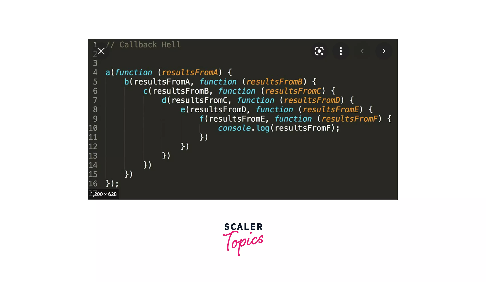

short notes :- https://www.edureka.co/blog/interview-questions/javascript-interview-questions/

Javascript Topics:

- https://www.geeksforgeeks.org/primitive-and-non-primitive-data-types-in-javascript/F
# 1. Primitives data types

src:- https://developer.mozilla.org/en-US/docs/Glossary/Primitive#:~:text=In%20JavaScript%2C%20a%20primitive%20(primitive,bigint

### ans:- In JavaScript, a primitive (primitive value, primitive data type) is data that is not an object and has no methods or properties. There are 7 primitive data types:
       1. string
       2. number
       3. bigint
       4. boolean
       5. undefined
       6. symbol
       7. null

### What is the difference between null, undefined, and NaN?

- NaN: Not a number: As the name implies, it is used to denote that the value of an object is not a number. There are many ways that you can generate this error, one being invalid math opertaions such as 0/0 or sqrt(-1)

- undefined: It means that the object doesn't have any value, therefore undefined. This occurs when you create a variable and don't assign a value to it.

- null: It means that the object is empty and isn't pointing to any memory address.

# 2. Variables, string, numbers, booleans, undefined, null, NaN

# 3. Arithmetic operators

src:- https://www.w3schools.com/js/js_arithmetic.asp

```javascript
        Operator	Description
           +	        Addition
           -	        Subtraction
           *	        Multiplication
           **	        Exponentiation (ES2016)
           /	        Division
           %	        Modulus (Remainder)
           ++	        Increment
           --	        Decrement
```

# 4. Comparison operators

```javascript
      Operator	  Description   	     Comparing    	Returns
        ==	        equal to	            x == 8	         false
                                               x == 5	         true
                                               x == "5"	         true
        whereas the === operator compares the values as well as the data types of the operands.
        ===	 equal value and equal type      x === 5	         true
                                               x === "5"	  false
        !=	       not equal	            x != 8	         true
        !==	 not equal value or not          x !== 5	         false
               equal type
                                               x !== "5"	  true
                                               x !== 8	         true
        >	greater than	                   x > 8	         false
        <	less than	                   x < 8	         true
        >=	greater than or equal to	     x >= 8	         false
        <=	less than or equal to	     x <= 8	         true
```

eg.:-

1.  undefined == null true;
2.  undefined === null false;
3.  Nan == Nan false;
4.  Nan === Nan false;
5.  [] == [] both have different memory storing address thats why false
6.  {} == {} both have different memory storing address thats why false

## Truthy

In JavaScript, a truthy value is a value that is considered true when encountered in a Boolean context. All values are truthy unless they are defined as falsy. That is, all values are truthy except false, 0, -0, 0n, "", null, undefined, and NaN.

JavaScript uses type coercion in Boolean contexts.

Examples of truthy values in JavaScript (which will be coerced to true in boolean contexts, and thus execute the if block):

```javascript
if (true)
if ({})
if ([])
if (42)
if ("0")
if ("false")
if (new Date())
if (-42)
if (12n)
if (3.14)
if (-3.14)
if (Infinity)
if (-Infinity)
```

## Falsy

A falsy value is something which evaluates to FALSE, for instance when checking a variable. There are only six falsy values in JavaScript:

1.  undefined,
2.  null,
3.  NaN,
4.  0,
5.  "" (empty string), and
6.  false of course.

EXAMPLES:-

### 5 && 2 && 0 || 2 && 3 || 15 && 21

    (T    T    F)  (T:2T:3)   (T     T)
          F      ||   T:3  ||  T:21

ANS:- 3;

### 5 && 18 && 8 || 15 && 20 && 0 || 80 && 100 && 7

ANS:- 8
in and we take last value when true and in or take first value when true

### 5 && 2 && 0 || 2 == 3 || 15 && 21

ANS:- 21

### 5 && 2 && 0 || 2 == 3

ANS:- false

# 5. Logical operators

Logical operators are used to determine the logic between variables or values.
Given that x = 6 and y = 3, the table below explains the logical operators:

```javascript
    Operator  	Description 	Example
      &&	           and	    (x < 10 && y > 1) is true
      ||	           or	    (x == 5 || y == 5) is false
      !	               not	    !(x == y) is true

```

basic examples:-

# 6. Conditional Statements (if else, switch)

```javascript
if (condition) {
  // Block of code if condition true
} else {
  // Block of code is condition false
}
```

#### Switch

In the switch statement, we compare the condition value with multiple cases. When there is a match with any one of the cases, the block of code corresponding with that case is executed. Each case has a name or a number, which is known as its identifier. If none of the cases matches the condition, the block of code corresponding to the default case is executed.

```javascript
switch (condition) {
  case identifier1:
    //block of code
    break;

  case identifier2:
    //block of code
    break;

  case identifier3:
    //block of code
    break;

  case identifiern:
    //block of code
    break;

  default:
  //block of code
}
```

src:- https://www.scaler.com/topics/c/difference-between-if-else-and-switch/

### Ternary Operator in C

src:- https://www.scaler.com/topics/c/ternary-operator-in-c/

# 7. Scope

src:- https://github.com/getify/You-Dont-Know-JS/blob/1st-ed/scope%20%26%20closures/ch5.md#nitty-gritty

Scope determines the accessibility (visibility) of variables. Scope determines the accessibility of variables, objects, and functions from different parts of the code.

- JavaScript has 3 types of scope:

1. Block scope :- Variables declared inside a { } block cannot be accessed from outside the block
2. Function scope :-Variables declared within a JavaScript function, become LOCAL to the function
3. Global scope :- Variables declared Globally (outside any function) have Global Scope.
   src:- https://www.w3schools.com/js/js_scope.asp

- Automatically Global:- If you assign a value to a variable that has not been declared, it will automatically become a GLOBAL variable.

```javascript
myFunction();

// code here can use carName

function myFunction() {
  carName = "Volvo";
}
```

# 8. Functions, arguments, return statement,

- JavaScript functions are used to perform operations. We can call JavaScript function many times to reuse the code.

- Advantage of JavaScript function
  There are mainly two advantages of JavaScript functions.

1. Code reusability: We can call a function several times so it save coding.
2. Less coding: It makes our program compact. We don’t need to write many lines of code each time to perform a common task.
   JavaScript Function Syntax
   The syntax of declaring function is given below.

```javascript
function functionName([arg1, arg2, ...argN]) {
  //code to be executed
}
```

JavaScript Functions can have 0 or more arguments.

- Default Parameters
  If a function is called with missing arguments (less than declared), the missing values are set to undefined.
  ES6 allows function parameters to have default values.
  sr:- https://www.w3schools.com/js/js_function_parameters.asp

- Function Return

When JavaScript reaches a return statement, the function will stop executing.

If the function was invoked from a statement, JavaScript will "return" to execute the code after the invoking statement.

Functions often compute a return value. The return value is "returned" back to the "caller":

Example
Calculate the product of two numbers, and return the result:

```javascript
let x = myFunction(4, 3); // Function is called, return value will end up in x

function myFunction(a, b) {
  return a * b; // Function returns the product of a and b
}
```

# 9. Callbacks, higher order functions

$ src:- https://blog.greenroots.info/higher-order-functions-in-javascript

- A Higher-Order Function is a regular function that takes one or more functions as arguments and/or returns a function as a value from it.

```javascript
// Define a function that takes a function as an argument.
function getCapture(camera) {
  // Invoke the passed function
  camera();
}

// Invoke the function by passing a function as an argument
getCapture(function(){
  console.log('Canon');
});


Now let us take another function that returns a function.


COPY
// Define a function that returns a function
function returnFunc() {
  return function() {
    console.log('Hi');
  }
}

// Take the returned function in a variable.
const fn = returnFunc();
// Now invoke the returned function.
fn(); // logs 'Hi' in the console

// Alternatively - A bit odd syntax but good to know
returnFunc()(); // logs 'Hi' in the console
```

Both of the examples above are examples of Higher-Order functions. The functions getCapture() and returnFunc() are Higher-Order functions. They either accept a function as an argument or return a function.

Please note, it is not mandatory for a Higher-Order function to perform both accepting an argument and returning a function. Performing either will make the function a Higher-Order function.

```javascript
const add = (a, b) => {
  return a + b;
};
const sub = (a, b) => {
  return a - b;
};
const mul = (a, b) => {
  return Math.abs(a * b);
};

//master calculator
const calculator = (num1, num2, operator) => {
  //accepting another function as an arguments :- Higher Order Function
  return operator(num1, num2);
};
console.log("add:", calculator(2, 3, add)); // passing function as an argument to another function :- callback function
console.log("sub:", calculator(2, 3, sub));
console.log("mul:", calculator(2, 3, mul));
// A callback function is a function that is passed to another function with the expectation that the other function will call it.

//   Higher-Order Functions(HoF): A function that takes another function(s) as an argument(s) and/or returns a function as a value.
// Callback Functions(CB): A function that is passed to another function.
```

```javascript
// A function
function fnc() {
  console.log("Just a simple javascript function");
}

// A function which is taking another function as an parameter
function higherOrderFunction(callback) {
  // Calling the function which is passed as the parameter, it is referred to as a callback
  callback();
}

// Passing a function
higherOrderFunction(fnc);
```

<br/>
<br/>

# 10. Pure Function

It is a function that produces the same output for the same input. It means it returns the same result when you pass the same arguments. A pure function shouldn't have any side effects to change the expected output.

The function sayGreeting() below is a pure function. Can you please guess why?

```javascript
function sayGreeting(name) {
  return `Hello ${name}`;
}
```

It is a pure function because you always get a Hello <name> as output for the <name> pass as an input. Now, let us see the same function with a bit of change.

```javascript
let greeting = "Hello";

function sayGreeting(name) {
  return `${greeting} ${name}`;
}
```

Is it a pure function? Well, No. The function's output now depends on an outer state called greeting. What if someone changes the value of the greeting variable to Hola? It will change the output of the sayGreeting() function even when you pass the same input.

```javascript
// When greeting is "Hello"
sayGreeting("Alex"); // Returns, "Hello Alex"

// When greeting is "Hola"
sayGreeting("Alex"); // Returns, "Hola Alex"
```

So, here we have seen the side-effect of depending on an outer state value that may change without the function being aware of it.
<br/>
<br/>

# 10. Arrays

- Array is a Data structure, which collects similar data elements stored at contiguous memory locations which means memory allocation allocates consecutive blocks of memory to a file/process. It is the simplest data structure where each data element can be accessed directly by only using its index number.
- An array is a non-primitives data type.
- Example: - if we want to store 5 different subject marks then there’s no need to define individual variables for each subject. If we want to get any subject marks, we have to just reach that particular element.

What is a multidimensional array?

- Mainly Multi-Dimensional arrays have two types 2-D and 3-D. 2-D means array inside an array, whereas 3D means arrays inside an array, inside an array.
- Basically, the 2D array is an extension of the matrix where we have rows and columns to catch any particular element inside the matrix.
- The basic application of the 2-D array is the Sudoku game while booking movie tickets on book my shop we see seats in the form of rows and columns there also use this concept, such as snake and ladder games, etc.
  • 3D:- is normally used for a complex problem like a simulation of complex analysis.

1. declaration:-

```javascript
let arr = []; //empty
let arr = new Array(n).fill(0);
```

2. accessing items :- It is the simplest data structure where each data element can be accessed directly by only using its index number.

- eg.

```javascript
let arr = [1, 2, 3, 4, 5, 6, 7, 8];
arr[5] = 6;
```

3. assignment :-
4. Array methods :-

   - array.fill()
   - array.map();
   - array.filter();
   - array.indexOf();
   - array.map();
   - array.forEach();
   - array.join();
   - array.split();
   - array.reduce();
   - array.filter();

5.

```javascript
let arr = [1, 2, 3, 4, 5, 6, 7, 8, 9];
// ForEach
// it is similar like a for loop
arr.forEach((ele, index) => console.log(ele));

//map
// The map() method creates a new array populated with the results of calling a provided function on every element in the calling array.
let newMap = arr.map((ele, index) => ele * 2);
console.log("newMap:", newMap);

//filter
// filter array base on our condition and return array
let newFilter = arr.filter((ele, index) => ele % 2 === 0);
console.log("newFilter:", newFilter);

//reduce
// its return single integer
let reduceResult = arr.reduce((acc, ele) => acc + ele, 0);
console.log("reduceResult:", reduceResult);
```

6. Why arr === obj is true ?

```javascript
//arr == obj
let arr1 = [];
let obj1 = {};
let double = arr1 == obj1; //False
let triple = arr1 === obj1; // False
let typeDouble = typeof arr == typeof obj1; //  True
let typeTriple = typeof arr === typeof obj1; // True

console.log("arr === obj", double);
console.log("arr === obj", triple);
console.log("typeOf:", typeDouble);
console.log("typeOf:", typeTriple);
```

# 11. for loops, while, do while

# 12. Objects

difference from arrays
key value pair
accessing values
assigning values
methods
for in loop
this

# 13. hoisting

# 14. scopes

global
local scope
block scope
closures
lexical scoping

Execution context
strict mode
solve problems faster by using objects
recursion

# 15. DOM manipulation

createElement
append
getElementById
querySelector
querySelectorAll
setAttribute
children methods
event API, eventListener
event bubbling
event capturing
style and attribute manipulation with DOM

# 16. JSON

src:- https://github.com/typicode/json-server

# 17. Difference Between Synchronous vs Asynchronous JavaScript?


src:- https://www.scaler.com/topics/synchronous-and-asynchronous-javascript/

### Call Stack

- As JavaScript is a single-threaded programming language, the JavaScript engine has a single call stack that is capable of performing only one action at a time. This single call stack is used by the JavaScript engine for managing execution contexts such as GEC(Global Execution Context) and FEC(Function Execution Context). We can also say that it is the call stack that keeps track of the functions or the code to be executed and then executes them one by one. This call stack works on the principle of LIFO, which is an abbreviation of "Last In First Out". This principle itself says that the code instruction or statement that comes last in the call stack is executed first and then popped off from the call stack.

## The Browser

- Someone said that don't underestimate the power of a common man and a browser it is really very powerful. We already know that the code is executed inside the call stack, this call stack is located inside the JavaScript Engine which is located inside the Browser.

- The browser has access to various things like local storage access, timer access, geo-location access, Bluetooth access, URL, etc. with the help of Web APIs. This means that the browser can communicate with the external world. So, We can say that it is the browser that combines the power of Web APIs with the JavaScript Call Stack and fulfills the need of the call stack such as providing the delay(timer) for some callbacks with the help of setTimeout() method. So the Browser, with the help of Web APIs makes it possible for the code inside the call stack to have a timer(and other such facilities) available.
  

## The Callbacks in JavaScript

for call back :- https://www.scaler.com/topics/javascript/asynchronous-javascript/

This results in unnecessary time consumption, which can create a negative impact when performing huge operations. Hence it is necessary to solve this problem. This can be solved using the callbacks.

```javascript
For example:

const fetchData = (anyURL) => {
  setTimeout(() => {
    console.log('Asynchronous Code here');
  }, 3000);
  // requestedData = ...code
  return dataFetched;
}

function someFunction(){
    // function code here
}
fetchData('url here');
someFunction();
```

## The Web APIs

- There are various Web APIs like setTimeout(), fetch(), console(o yeah it is also one of the Web APIs), etc that are used by the browser to fulfill the need of the call stack. Now it is important to know that the setTimeout(), console, and all these Web APIs are not part of JavaScript. Yes, you read that right. These are part of Web APIs and are connected or combined with the call stack of JavaScript Engine with the help of Browser. We can also say that Browser acts as the communicating medium between the call stack and the Web APIs. Let us see these Web APIs inside the code practically with the example of setTimeout().

# Notes:-

- It should be noted that the web APIs, the event loop, the task queue, and the microtask queue are not part of the JavaScript engine, instead, they are a part of the browser’s JavaScript runtime environment. While in Nodejs, the web APIs are replaced by the C/C++ APIs.

# The Event Loop and the Callback Queue in JavaScript

https://www.scaler.com/topics/javascript/asynchronous-javascript/

So here comes a very interesting part of our article: the event loop.

Let us understand this by an example.

```javascript

console.log("I am start");
setTimeout(function iAmCallBack() {
    console.log("I am a callback inside setTimeout() method")
}, 4000)
console.log("I am end");
Output:

I am start
I am end
// after 4 seconds
```

- I am a callback inside setTimeout() method
  So during the execution of the above code, a GEC (Global Execution Context) is created, and the first code is pushed to the top of the call stack and executed immediately hence 'I am start' gets printed inside the console then it is popped off from the call stack and next code i.e. setTimeout() is pushed inside the call stack and the timer (here 4 seconds) starts, now the callback which is located inside the setTimeout() is registered in the Web APIs environment and then the next code is pushed to the top of the call stack hence 'I am end' is console logged and then it is also popped off from the call stack. Meanwhile, the timer that was started by the setTimeout() expires, and the callback that was registered inside the Web APIs environment is ready to be executed but wait it can not be pushed inside the call stack directly, and here comes the most important thing that is the Event Loop and the callback queue.

- First of all, the callback (which is ready to be executed) is sent to the callback queue(provided by the browser), which is also known as the task queue or message queue. Then the event loop checks whether the call stack is empty or not, if it is empty, then the callback which is standing in a queue (as we stand in a queue outside the voting booth is sent to the call stack and if the call stack is not empty then the callback has to wait in the queue till the stack gets empty. Hence after 4 seconds (4000 ms), the callback function "iAmCallback" is sent to the task queue, and then after the event loop's assurance, it is pushed to the top of the call stack and executed immediately. Hence we get "I am a callback inside the setTimeout() method" printed inside the console after 4 seconds but it should be noted that if the stack gets empty after 10 seconds or so, the callback function "iAmCallback" will be called after 10 seconds only. Now it is clear that the main task of the event loop is to check the emptiness of the call stack and if it is found to be empty, allow the callback to enter the call stack.

### But why is there a callback queue?

It is because of the number of callbacks inside a program. As there can be so many callbacks inside a program, it is important to ensure that all the callbacks get called according to their sequence of occurrence inside the callback queue. Hope that clears your concept. There is one more queue called the microtask queue in which the promises are stored. Note that the callbacks inside the microtask queue are given priority for the execution of the callback inside the task queue.

Asynchronous-Browser-Web API's-callStack-task Queue-callBack-Promises-SetTimeOut
src:- https://www.scaler.com/topics/javascript/asynchronous-javascript/

1. JavaScript is a single-threaded programming language.
2. JavaScript has only one call stack, which is used for code execution.
3. Blocking is very dangerous and affects the user experience badly.
4. Blocking can be avoided or solved using asynchronous JavaScript.
5. Browsers can communicate with the outside world with the help of various Web APIs.
6. Browsers combine the power of Web APIs with the call stack.
7. setTimeout() is not a part of JavaScript, instead, it is a Web API.
8. Console and fetch() are also part of Web APIs.
9. Functions that are passed inside other functions as arguments are called Callbacks in JavaScript.
10. Callbacks introduce us to the whole world of asynchronous JavaScript.
11. The main task of the event loop is to check the emptiness of the call stack, and if it is found to be empty, it allows the callback to enter the call stack.
12. Promises are stored in the microtask queue and are given priority over normal callbacks by the event loop.
13. Callback hell can be avoided by using Promises.

# Promises in JavaScript

src:- https://www.scaler.com/topics/javascript/promises-in-javascript/

- Need for Promises in JavaScript

1. JavaScript is single-threaded, i.e., it can perform only one task at a time. To handle asynchronous tasks in JavaScript
2. To handle blocking of execution thread because asynchronous tasks take time to complete.

# What is a Promise in JavaScript?

- Water fall request.

- A promise in JavaScript is no different from a promise in real life. If you take a promise from me that I will bring you a bar of chocolate, there can be three cases here:

- You are waiting for me to come (the promise is in a PENDING state)
  I bought you a bar of chocolate (the promise is in a FULFILLED state)
  The shop was closed, or due to any reason, the promise failed ( the promise goes to the REJECTED state).
  Similarly, when you call an asynchronous function, i.e., a function that might send a response in the future, you are actually taking a promise. At first, the promise remains in the PENDING state because no response has been received. After some time, when the response is received, there are two possible cases:

- We got a response (i.e., the promise goes to the FULFILLED state)
  We got an error and no response (the promise got REJECTED)
  Note: Getting a response means the promise is in the SETTLED state. In other words, the promise is not in the PENDING state now, and it has been either RESOLVED or REJECTED.
  

### How Promises Work

- In technical terms, a promise is an object that is returned as a response to an asynchronous function. It can be one of these four possible states:

1. PENDING
2. FULFILLED
3. REJECTED
4. SETTLED

- Let us understand this in a bit more detail. The moment a promise is invoked, it goes to the PENDING state and waits for a response to come. We might get the correct response, which makes the promise FULFILLED, or we might get an error, i.e., the promise goes to the REJECTED state. A promise is said to be SETTLED if it is not in the pending state, i.e., either the response has arrived or an error has occurred.

Note: Once settled, a promise cannot be resettled.

### CallBack Hell

- Before promises came up, callbacks were used to handle asynchronous code. Callbacks showed a serious problem called the Callback Hell

- When it comes to asynchronous tasks, i.e., where we might not get a response immediately, we need to handle this in a very different way. One of the ways is to use callbacks. Consider this:

```javascript

// Callback is a function sent as a parameter to another function.
//

const getData = (id, callbackFunction) => {
    const data = request data for given id user from db
    callbackFunction(data);
}

const data = getData(123, (data) => console.log(data))
```

- We are sending the action to be performed after the completion of the asynchronous task as a parameter to the first function. Suppose we want to filter the data and display an image corresponding to this id.

Note: Loading an image from the database will also need time and is an asynchronous task.

```javascript

// This function return the data
const getData = (id, callbackFunction) => {
    const data = request data for given id user from db
    callbackFunction(data);
}

// This function return the image
const getImage = (data, callbackFunction) => {
    const imageSrc = data.imageSrc;
    callbackFunction(imageSrc);
}
const displayImage = () => {
    //displays the image
}

// This function calls the above functions to get data and THEN get image.
const DisplayImageWithID = (id) => {
    getData(id, (data) => {
        getImage(data, (imageSrc) => {
            displayImage(imageSrc);
        })
    })
}

DisplayImageWithID(123);
```

```javascript
Look at this, the same code with callback being written with promises.


// This function returns data corresponding to an id
const getData = (id) => {
    const data = request data for given id user from db
    return data;
}

// This function send the image source from the data
const getImage = (data) => {
    return data.imageSrc;
}

// This function will displat the image.
const displayImage = () => {
    //displays the image
}

// Main function calling the above functions
const DisplayImageWithID = (id) => {
    getData(id)
    .then(data => getImage(data))
    .then(imageSrc => displayImage(imageSrc))
}
```

Now, this can lead to callback hell,


# The Important Rules of Promise

1. A standard promise comes with a pre-defined .then() method.
2. A promise is initially in the pending state, which transitions into a fulfilled or rejected state after some time.
   Fulfilled or rejected states are settled states. 3. A promise, once settled, cannot be resettled, i.e., a settled state can not transition into any other state.
3. Once settled, a promise will have value. If fulfilled, the promise will have the data requested. If rejected, it will contain undefined. But it will always have a value after being settled, which cannot be changed.
   

### Promise Chaining

- Callbacks and promises are both used to handle asynchronous code in JavaScript. When you use callbacks, you send callback functions as parameters to another function. Using promises, you do not need to PASS callback functions. But instead, ATTACH them with the promise using the .then() method.

- So, you still need to use callbacks while working with promises, but differently.
  .then() always returns another promise. So, we can chain promises like this.

```javascript
fetch(url_to_get_data).then(filterData).then(consoleData).catch(handleError);
```

Promise Chaining works like try, and catch, but it makes asynchronous code look more like the synchronous one. The code here works sequentially, i.e., line by line

### Conclusion

1. JavaScript can perform only one task at a time, and if a task takes longer to complete, the JavaScript thread cannot wait for it.
2. Asynchronous tasks need to be handled differently.
3. To handle asynchronous tasks effectively, we have promises in JavaScript.
4. Promises are exactly what you would expect from its name. They make a promise that a response will be sent to the browser. Meanwhile, other tasks can be performed.
5. Promises can have four states - PENDING, FULFILLED, REJECTED, and SETTLED.
6. When a promise is triggered, it is in the Pending state. After some time, this asynchronous task might be completed and return with one of these statuses - fulfilled or rejected.
7. A promise fulfilled or rejected is said to be in the SETTLED state. Once settled, a promise cannot be resettled.
8. How does the browser get to know when a promise gets a response? We have the following methods for the same.

- .then()
- .catch()
- .finally()

##Examples
[label](Promises.js)

  <br/>
  <br/>
  <br/>

# Event Loop in JavaScript

src:- https://www.scaler.com/topics/javascript/event-loop-in-javascript/

<br/>
<br/>
<br/>

# Async Await in JavaScript

src:- https://www.scaler.com/topics/javascript/async-await-javascript/

## Async

- The async keywords stand for asynchronous. It was introduced to solve the issues that were faced by promises. So, async works on Promises.
  The work of async is to make a function work without the need of freezing the complete program.

- The async keyword is used before the function will return a value. Or we can say that it works as resolved/fulfilled in promise.

```javascript
Syntax;

async function Ex() {
  return "Promise";
}
```

Without Await Async will work properly

```javascript
/* Async keyword used before a function */
async function example() {
  return "Resolve";
}

/* if we console.log the function example(),
 we get the result as - 
 Promise {<fulfilled>: 'Resolve'}
*/
/* We use then function to return Promise */
example().then((data) => {
  console.log(data); //Resolve
});
```

## Await

The Await keyword is used inside the async function. The work of await is to wait for the execution thread to wait until the result is resolved and then returns the result. As await is used inside an async function, it only makes it wait, not the complete program.

```javascript
Syntax;

/* It is only used inside async function */
let result = await promise;
```

## Benefits of Using Async Function

There are few benefits or async over promise and the callback function.

1. Code readability - It makes code easy to write and read because async functions can be chained easily using promise.all() makes it easier to read than with plain promises.
2. We can handle errors easily. Errors can be easily handled using try-catch handlers.
3. Async function makes debugging simpler because to the compiler the code looks synchronous.

## Conclusion

1. Async/await works on the concept of Promise. Async defines the fulfillment of a promise and returns a promise.

2. We use async before the function that allows us to return promise-based codes.
3. Await can be used only in async functions. It is used to make the function wait until and unless the promise is resolved or rejected and then returns the result.
4. We use the try...catch method for error handling in async/await.
5. Async/await makes asynchronous code that is easy to read and write.

<br/>
<br/>
<br/>

# Closure in JavaScript

src:- https://www.scaler.com/topics/javascript/javascript-closures/

## What are Scopes?

Scopes in Javascript are the portion of the code where the variable is accessible. Let us walk through some examples:

```javascript
const name = "Aryan";
console.log(name); // Aryan
if (true) {
  let superhero = "Might Raju"; // same for const as well
  console.log(superhero);
}
console.log(superhero); // throws  ReferenceError
```

In Javascript we have different types of scopes, some of them are:

1. Global Scope:
   As the name suggests, the variable which is accessible from everywhere in the program is said to exist in the global scope.
   Ex:

```javascript
let name = "Aryan";
const mainFunction = () => {
  console.log(name);
};

mainFunction(); // Aryan
console.log(name); // Aryan
```

- Here the variable name is accessible inside the main Function as well outside it. The name can be accessed from anywhere in the code. So the name exists in the global scope. 2. Global Scope 3. Functional Scope.

2. Function Scope or Local Scope:
   When a variable is declared inside the function, it can only be accessed from within that function. This means that this variable exists in the functional scope and cannot be used outside this scope.
   Ex:

```javascript
const main = () => {
  const newName = "Aryan"; // newName defined in function scope
  console.log(newName);
};
main();
// trying to access newName outside the function
console.log(newName); // ReferenceError
```

3. Block Scope

- With the introduction of let and const keywords, variables can be scoped to the nearest block of code or pair of curly braces "{}". Just for the information, var is not block scoped.

```javascript
{
  let name1 = "Aryan"; // name1 in block scope
  console.log(name1); // Aryan
}

{
  var newName = "Kaush"; // newName not in block scope as var is used
  console.log(newName); // Kaush
}

console.log(name1); // ReferenceError
console.log(newName); // Kaush
```

4. Lexical Scopes:
   In the example, we saw that the variable of outer scope is easily accessible to the inner scope. This is possible because of lexical scoping. In the above example, the lexical scope of newFunction consists of the lexical scope of demoFunction and global scope. In easy terms, lexical scoping means that inside an inner scope you can use the variable of outer scope. It is called lexical scope as the engine detemines the scopes during the lexing time.

```javascript
function demoFunction() {
  let name = "aryan";
  function newFunction() {
    console.log(name); // logs aryan as name is available to newFucntion
    // because of nesting of scopes.
  }

  newFunction();
}
demoFunction();
// Here, name is accessible to the newFunction and when newFunction is called, it logs the name.
```

## Closures

- A closure is the combination of a function bundled together (enclosed) with references to its surrounding state (the lexical environment). As we know what lexical scoping is, this definition is explanatory.
  

```javascript
function outerFunction(number) {
  let initial = 1;

  function innerFunction(newNumber) {
    initial = initial * newNumber + number;
    return initial;
  }
  return innerFunction;
}

let returnedFunction = outerFunction(2); // returnedFunction here is same as innerFunction.
console.log(returnedFunction(1)); // 3
console.log(returnedFunction(3)); // 11
```

- Here, we have an outerFunction, which has an innerFunction. This innerFunction is manipulating the initial which is defined in its outer scope. Now when we call outerFunction, it returns innerFunction and when we try to call innerFunction, we see that it still has access to an initial, though the function is called outside the scope of outerFunction. This is possible because of closures. Because of closures, functions in Javascript can close over the value of their outer scope and remember them. So no matter from which scope they are called, they can easily access the variables in their outer scope. So a sweet, simple, and intuitive definition of closure can be:

## "A closure is a function that remembers its outer variables and can access them even when called independently."

  <br/>
  <br/>
  <br/>

## Currying:

- Currying is the pattern of functions that immediately evaluate and return other functions.
- This is made possible by the fact that Javascript functions are expressions that can return other functions.
- Curried functions are constructed by chaining closures by defining and immediately returning their inner functions simultaneously. It is a very powerful technique and is frequently asked.

```javascript
Example: function sum(a) {
  return function (b) {
    return function (c) {
      return a + b + c;
    };
  };
}

let ans = sum(4)(5)(8);
console.log(ans); // 17
```

## Summary

1. Closures in Javascript is something that is used by everyone but still, most of the developers are not familiar with it and it is completely fine. Closures are hard to get your head around and you will become better and better with time. So to wrap this article, let us go through the important points we discussed in this article:

2. A closure in JavaScript is a feature where an inner function has access to the outer (enclosing) function’s variables — a scope chain.

3. Closures in Javascript are created along with the function.

4. Lexical scoping is the environment that holds the variables of the current scope as well as the outer scope.

5. As each scope in Javascript has access to its parent's scope or outer environment, we can nest these scopes in hierarchical order called scope chaining.

6. Each closure has three scopes namely global scope, function scope or local scope, and block scope.

7. In languages using static scopes, variables are referenced at the time of creating whereas, in dynamic scoping, variables are referenced at run time.

8. With the help of closures, we can solve the for loop dilemma in Javascript.

9. Closures in Javascript find their uses every time a function is created. Some common use cases are Higher Order Functions, Currying, and Function decomposition.

<br/>
<br/>
<br/>

# Hosting

src:- https://www.scaler.com/topics/hoisting-in-javascript/#es5

```javascript
console.log(temp);
var temp = "Scaler";
Output: undefined;
```

- The code actually looks like the following to the javascript engine,

```javascript
var temp;
console.log(temp);
temp = "scaler";
```

- It is putting the declaration of the variable at the top of the code and the temp variable is assigned a value undefined (a primitive data type) and because we console it we get the same, this is an example of javascript hoisting.

## Definition:-

## "The javascript mechanism in which variables and function declarations are moved to the top of their scope before execution of the code is called as Hoisting."

<br/>

## Behind the scenes of Hoisting in Javascript

Let us look at some concepts which we must understand if we want to fully make sense of Hoisting in Javascript.

## Execution context:

- In layman's terms, an execution context refers to an abstract environment where the javascript code gets executed. This environment consists of what are the variables, functions, objects in its scope, the memory allocated and the line by line execution of the code.
- The execution context created on the first time parsing the code is called global execution context(GEC), the ones created after it is called local/functional execution contexts(FEC).

## Creation of execution context

How Javascript executes the code behind the scenes is that it creates a (global) execution
context. This execution context creation has two phases: Creation and Execution

1. Creation phase:

- Javascript engine first scans the code, registers the variables in the scope and allocates memory to all the variable and function declarations.
- If it encounters a variable, it is given the value undefined, and if it encounters a function, then the value is the function code itself, and a new (local) execution context is created.

2. Execution phase:

- After the creation phase, JS engine executes the code line by line.
  So in our previous example:

```javascript
console.log(temp);
var temp = "Scaler";
```

the temp variable will first be assigned the value undefined, and then the execution happens line by line.
Creation of execution context

This is the core of Hoisting; when we say variables and function declarations are moved to the top of the code, this is what we mean, the variables are registered in the scope, memory is allocated before the code execution begins because of which it seems like as if they are available to us on the top of the code!

```javascript
var temp; // allocated memory and undefined value;
console.log(temp); // Returns 'undefined'
temp = "Scaler"; // Initialization
console.log(temp); // Returns 'Scaler'`
```

ES6
let and const Hoisting in Javascript

let and const were introduced in ES6. Is hoisting possible with let and const? Though in many places you will see that the answer is No. This is not true All javascript variables are hoisted irrespective of var or let or const declaration, but let and const are hoisted differently. Let us look in-depth into this in the next sections.

Takeaway:

let and const are hoisted in Javascript but they are hoisted differently than var

let keyword Hoisting in Javscript
Let us look at the following code:

console.log(temp)
let temp= "Scaler"
Output:

Uncaught ReferenceError: Cannot access 'temp' before initialization at ++script.js.1++
We got an error that we did not see in the previous examples. The reason for this is var is both declared and initialized during Hoisting, but let is not initialized it is only declared. The variable is in a temporal dead zone(TDZ) till then.

Let us see the let variable lifecycle to understand this better:
let variable lifecycle

Explanation:

In the creation phase for variables declared with let only declaration occurs there is no initialization.
A variable declared with let will be initialized only during the execution phase when the JS engine reaches the line with let keyword at this point it will be given the value undefined
The gap we see between the point at which the variable is in the uninitialized state and the point where it gets initialized is called the Temporal dead zone (TDZ)
Then the assignment happens temp is given the value "Scaler".
Takeaway:

var is both declared and initialized during Hoisting, but let is not initialized it is only declared.Hence when we try to access a let variable before it is declared we get an error.

const keyword Hoisting in Javascript
const hoisting is the same as let hoisting except one difference. In let the assignment happens after initialization but in const the assignment and initialization happen together, this is because once assigned the value of const cannot change, if we assign undefined and then assign another value this breaks the rule of const

Example:

console.log(temp)
const temp = "Scaler"
Output:

Uncaught ReferenceError: Cannot access 'temp' before initialization at ++script.js.1++
const variable lifecyle
)

explanation:

In the creation phase for variables declared with let only memory is allocated, there is no initialization.
A variable declared with const will be initialized only during the execution phase when the JS engine reaches the line with the const keyword, at this point assignment will happen and it will be given the value it is declared with.
The gap we see between the point at which the variable is in the uninitialized state and the point where it gets initialized is called the Temporal dead zone (TDZ).
Takeaway:

var is both declared and initialized during Hoisting, but const is not initialized; it is only declared. Hence when we try to access a const variable before it is declared, we get an error.

Conclusion
The javascript mechanism in which variables and function declarations are moved to the top of their scope before code execution is called Hoisting.
Hoisting gives us an advantage that variables and functions can be accessed before they are declared.
Function expressions and arrow functions cannot be hoisted.
The sequence of variable declaration and initialization or the lifecycle of a variable is as follows: Declaration -> Initialization -> Assignment.
All variables in javascript are hoisted, but var variables are hoisted in one way and let , const are hoisted in another way.

# Callback Hell

scr:- https://www.scaler.com/topics/nodejs/node-js-callback-hell/


# Q22. What is the difference between Attributes and Property?
- Attributes-  provide more details on an element like id, type, value etc.

- Property-  is the value assigned to the property like type=”text”, value=’Name’ etc.


using AJAX / XHR
callback, callback hell
asyncrnonous behavior in javascript
setTimeout
setInterval
event loop
call stack
task/event queue
WEB API
promises
promise chaining
advantage over callbacks
async, await
fetch API
axios
CORS
jQuery
IIFE
anonymous functions
Sets, Map
modules
localStorage, cookie, sessionStorage
ECMAScript, TC39
polyfill
tree shaking
HTTP protocols
Implementation of Stacks, Queues, Linked List, Trees (Binary Tree, Nary Tree), Graphs
Traversing, reversing, mirror, and other operations for LinkedList, Trees, Graphs (1st, 2nd, 3rd level)

# ES6 and others:

# call apply bind

src:- https://www.freecodecamp.org/news/understand-call-apply-and-bind-in-javascript-with-examples/

# Rest and Spread Operator

src:- [label](RestAndSpread.js)

var let const
arrow functions
template literals
destructuring
default params
event loop
promises, async, await, fetch, axios
classes
this
inheritance, and prototype
getters
setters
generators
yield
BigInt
Optional Chaining
