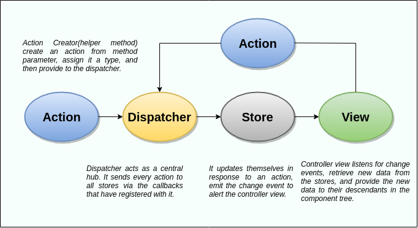

## https://www.interviewbit.com/react-interview-questions/

# 1. What are keys in React?

- In React, keys are special attributes that are used to identify and differentiate between different child components in a list. Keys are used to help React determine which elements have changed, been added, or been removed, so that it can efficiently update the UI without re-rendering the entire list.

# 2. What is Memoization in react?

- Memoization is a performance optimization technique used in React to reduce unnecessary re-renders of components. When a component is re-rendered, all of its child components are also re-rendered, even if their props have not changed. Memoization is a way to prevent this unnecessary re-rendering by caching the results of expensive function calls or computations, and only re-computing them if their inputs (i.e. the props or state) have changed.

# 3. What is the difference between react.memo and react.useMemo?

- The main difference between React.memo and React.useMemo is that React.memo is a higher-order component (HOC) that is used to memoize an entire component, while React.useMemo is a hook that is used to memoize a specific value or computation. React.memo is used to prevent unnecessary re-renders of a component by memoizing its props, while React.useMemo is used to memoize a specific value or computation within a component, so that it is only re-computed when its dependencies change.

  src=> https://codesandbox.io/s/react-memo-nxb619?file=/src/App.js

# 4. What are the parameters that react memo takes?

- React.memo takes two parameters: the first is the component that it is memoizing, and the second is an optional comparison function that is used to determine whether the component should be re-rendered. The comparison function takes two arguments (the previous props and the new props) and should return a boolean value indicating whether the props have changed. If no comparison function is provided, React.memo uses a default shallow comparison of props to determine whether the component should be re-rendered.

```javascript
// Default Shallow Comparison
import React from "react";

function MyComponent(props) {
  return <div>Hello, {props.name}!</div>;
}

export default React.memo(MyComponent);
```

```javascript
import React from "react";

function MyComponent(props) {
  return <div>Hello, {props.name}!</div>;
}

function arePropsEqual(prevProps, nextProps) {
  return prevProps.name === nextProps.name;
}

export default React.memo(MyComponent, arePropsEqual);
```

# 5. What are the different ways to apply useEffect?

- useEffect is a React hook that allows you to execute side effects in functional components. There are different ways to apply useEffect:
- side effects often refer to operations that affect the browser or the outside world, such as fetching data from a server, updating the document title, or setting a timer. These operations can cause a change in the state of the application or the user interface, and they are typically implemented using the useEffect hook.
- side effects are changes that happen outside the scope of a function or block of code, and they are often used in React to perform operations that affect the user interface or the outside world.

1. Without dependencies: When you pass an empty array as the second argument of useEffect, the hook will only be executed once, after the component is mounted.

```javascript
useEffect(() => {
  // Do something only once, after the component is mounted
}, []);
```

2. With dependencies: If you pass an array with dependencies as the second argument of useEffect, the hook will be executed every time one of the dependencies changes.

```javascript
useEffect(() => {
  // Do something every time `prop1` or `prop2` change
}, [prop1, prop2]);
```

3. Without cleanup: When you return a function inside the useEffect callback, React will run it when the component is unmounted. If you don't return a function, there is no cleanup.

```javascript
useEffect(() => {
  // Do something when the component is mounted
  return () => {
    // Do something when the component is unmounted
  };
});
```

4. With cleanup: You can also return a cleanup function that will be executed every time the effect is re-run or when the component is unmounted.

```javascript
useEffect(() => {
  // Do something when the component is mounted or when `prop1` changes
  return () => {
    // Do something when the component is unmounted or when `prop1` changes
  };
}, [prop1]);
```

src:- https://codesandbox.io/s/stopwatch-ehy9zj?file=/src/App.js

```javascript
// Example;
import "./styles.css";
import { useEffect, useState } from "react";

export default function App() {
  const [time, setTime] = useState(0);
  const [isRunning, setIsRunning] = useState(false);

  useEffect(() => {
    let intervalId;

    //mounting Phase
    if (isRunning) {
      intervalId = setInterval(() => {
        setTime(time + 10);
      }, 100);
    }

    //Unmounting phase
    return () => clearInterval(intervalId);
  }, [time, isRunning]);

  const handlePlayPause = () => {
    setIsRunning(!isRunning);
  };

  const handleRest = () => {
    setTime(0);
    setIsRunning(false);
  };
  return (
    <div className="App">
      <h1>StopWatch</h1>
      <h1>{time}</h1>
      <button onClick={handlePlayPause}>{isRunning ? "Pause" : "Play"}</button>
      <button onClick={handleRest}>Rest</button>
    </div>
  );
}
```

# 5.1 useEffect is the combination of

- useEffect is a React Hook that combines the functionality of multiple lifecycle methods from class components, including componentDidMount, componentDidUpdate, and componentWillUnmount.

- The useEffect hook is used to manage side effects, such as fetching data from a server, setting up event listeners, or updating the DOM. It takes two arguments:

- A function that describes the effect to be performed. This function is executed after every render of the component, including the first render after the component is mounted.

- An optional array of dependencies that determine when the effect should be re-run. If any of the dependencies change between renders, the effect will be re-run. If the array is empty, the effect will only run once, after the initial render.

- By default, the effect is cleaned up before the next effect is run, so you don't need to worry about cleaning up the effect manually. However, if you need to clean up the effect manually, you can return a function from the effect function that cleans up the effect, such as removing event listeners or cancelling timers.

- Overall, useEffect is a powerful tool for managing side effects in functional components, and can simplify code that would be more complex with class components.

# 6. How does Routing work with react?

- React Router is a popular library for implementing routing in React applications. It allows you to handle navigation and rendering of different components based on the current URL.
           
- React Router works by providing a set of components that you can use to define your routes. These components are:

1. <BrowserRouter>: This component is used to wrap your entire application and provides a history object that keeps track of the current URL.

2. <Route>: This component is used to define a route and specify which component should be rendered when the route is matched.

3. <Switch>: This component is used to wrap a set of <Route> components and render the first one that matches the current URL.

4. <Link>: This component is used to create links to different routes in your application.

Here is an example of how to use React Router:

```javascript
import { BrowserRouter, Route, Switch, Link } from "react-router-dom";

function App() {
  return (
    <BrowserRouter>
      <nav>
        <ul>
          <li>
            <Link to="/">Home</Link>
          </li>
          <li>
            <Link to="/about">About</Link>
          </li>
          <li>
            <Link to="/contact">Contact</Link>
          </li>
        </ul>
      </nav>
      <Switch>
        <Route exact path="/">
          <Home />
        </Route>
        <Route path="/about">
          <About />
        </Route>
        <Route path="/contact">
          <Contact />
        </Route>
      </Switch> 
    </BrowserRouter>
  );
}
```

# 7. What is SSR and CSR?

## SSR (Server-Side Rendering):

- SSR is the process of rendering a web page on the server and sending the pre-rendered HTML to the client. This can improve the performance and SEO of your application, as the user gets a fully rendered page immediately and search engines can index the content more easily. React provides support for SSR through libraries such as Next.js.

## CSR (Client-Side Rendering):

- CSR is the process of rendering a web page in the client's browser using JavaScript. In CSR, the server sends a minimal HTML file that loads a JavaScript bundle, which in turn fetches the data and renders the components in the browser. This approach can provide a more interactive user experience, but it may have a slower initial loading time, which can affect SEO. React provides support for CSR out of the box.

# 8. What are the lifecycle methods in class components?

- In React class components, there are several lifecycle methods that are called at different stages of a component's lifecycle. Here are the main lifecycle methods in order:

## 1. constructor(props):

- called when a component is first created, and is used to initialize the state and bind methods.

## 2. render():

- called when a component needs to render its output, and is used to create the JSX to be rendered.

## 3. componentDidMount():

- called after a component has been mounted into the DOM, and is used for side effects like fetching data from a server or setting up event listeners.

## 4. shouldComponentUpdate(nextProps, nextState):

- called before a component is re-rendered, and is used to optimize performance by preventing unnecessary re-renders. If this method returns false, the component will not update.

## 5. componentDidUpdate(prevProps, prevState):

- called after a component has been re-rendered, and is used for side effects like updating the DOM or fetching data from a server.

## 6. componentWillUnmount():

- called before a component is unmounted from the DOM, and is used for cleanup like removing event listeners or cancelling timers.

# 9. What are dependencies in useEffect?

- . In the useEffect hook in functional components, the second argument is an array of dependencies that determine when the effect should be re-run. If any of the dependencies change between renders, the effect will be re-run. If the array is empty, the effect will only run once, after the initial render. If there are no dependencies specified, the effect will be re-run after every render.

# 10. What is a pure component?

- A pure component is a React component that only re-renders when its props or state change. This is achieved by implementing a shallow comparison of the current props and state with the previous props and state. If there are no changes, the component will not re-render, which can improve performance. You can create a pure component by extending the React.PureComponent class, or by implementing the shouldComponentUpdate lifecycle method to perform the shallow comparison manually.

# 11. What is useCallback?

- useCallback is a hook in React that memoizes a function and returns a memoized version of it. This can improve performance in cases where a function is being passed down to child components as a prop, because it ensures that the function reference remains the same between renders if the dependencies have not changed. This can prevent unnecessary re-renders of child components. The dependencies array is similar to the one used in the useEffect hook, and specifies the values that the memoized function depends on.
- useCallback is a hook in React that is used to memoize functions so that they are not recreated on each render of a component. This can help improve performance by reducing unnecessary re-renders of child components that depend on these functions.

```javascript
import React, { useState, useCallback } from "react";

function MyComponent() {
  const [count, setCount] = useState(0);

  // This function will be recreated on every render
  function increment() {
    setCount(count + 1);
  }

  // This function will be memoized by useCallback
  const incrementCallback = useCallback(() => {
    setCount(count + 1);
  }, [count]);

  return (
    <div>
      <p>Count: {count}</p>
      <button onClick={increment}>Increment</button>
      <button onClick={incrementCallback}>Increment with useCallback</button>
    </div>
  );
}
```

# 12. What are useRefs? What are some use cases?

useRef is a hook in React that returns a mutable object that persists throughout the lifetime of the component. This object can be used to store values or references that need to be accessed between renders.

Here are some use cases for useRef:

1. Storing a reference to a DOM element: useRef can be used to store a reference to a DOM element so that it can be accessed or manipulated directly. For example, you can use useRef to store a reference to an input element and then use it to set the focus when the component mounts:

```javascript
import React, { useRef, useEffect } from "react";

function MyComponent() {
  const inputRef = useRef(null);

  useEffect(() => {
    inputRef.current.focus();
  }, []);

  return (
    <div>
      <input type="text" ref={inputRef} />
    </div>
  );
}
```

2. Storing previous state or props: useRef can also be used to store the previous value of a state variable or prop. This can be useful for comparing the current and previous values in order to trigger some behavior:

```javascript
import React, { useState, useRef, useEffect } from "react";

function MyComponent({ data }) {
  const [count, setCount] = useState(0);
  const prevDataRef = useRef(null);

  useEffect(() => {
    if (data !== prevDataRef.current) {
      setCount(count + 1);
      prevDataRef.current = data;
    }
  }, [data]);

  return (
    <div>
      <p>Count: {count}</p>
    </div>
  );
}
```

In this example, we are using useRef to store a reference to the previous value of the data prop. We can then compare the current and previous values in the useEffect hook and update the state if they are different.

3. Storing a value that doesn't trigger a re-render: useRef can also be used to store a value that doesn't need to trigger a re-render. For example, you can use useRef to store a timer ID for a setInterval call:

```javascript
import React, { useRef, useEffect } from "react";

function MyComponent() {
  const intervalIdRef = useRef(null);

  useEffect(() => {
    intervalIdRef.current = setInterval(() => {
      console.log("Tick");
    }, 1000);

    return () => clearInterval(intervalIdRef.current);
  }, []);

  return (
    <div>
      <p>Component content</p>
    </div>
  );
}
```

In this example, we are using useRef to store a reference to the interval ID returned by setInterval. We can then clear the interval in the cleanup function of the useEffect hook.

These are just a few examples of how useRef can be used in React. useRef is a versatile hook that can be used to store any value or reference that needs to persist throughout the lifetime of a component.

# 13. What are callback refs?

# 14. How does Context API work? What does it solve?

# 15. What does useReducer do?

useReducer is a hook in React that provides an alternative way to manage state in a component. It allows you to manage state through a reducer function, similar to how state is managed in a Redux store.

The useReducer hook takes two arguments: a reducer function and an initial state value. The reducer function takes two arguments: the current state and an action object. It returns a new state object based on the action.

Here's an example of how useReducer can be used:

```javascript
import React, { useReducer } from "react";

function reducer(state, action) {
  switch (action.type) {
    case "INCREMENT":
      return { count: state.count + 1 };
    case "DECREMENT":
      return { count: state.count - 1 };
    default:
      throw new Error();
  }
}

function MyComponent() {
  const [state, dispatch] = useReducer(reducer, { count: 0 });

  function handleIncrement() {
    dispatch({ type: "INCREMENT" });
  }

  function handleDecrement() {
    dispatch({ type: "DECREMENT" });
  }

  return (
    <div>
      <p>Count: {state.count}</p>
      <button onClick={handleIncrement}>Increment</button>
      <button onClick={handleDecrement}>Decrement</button>
    </div>
  );
}
```

In this example, we have a reducer function that takes a state object and an action object and returns a new state object based on the action. We also have a MyComponent function that uses the useReducer hook to manage a count state variable with an initial value of 0.

We have two functions, handleIncrement and handleDecrement, that dispatch actions to the reducer to increment or decrement the count. The dispatch function provided by useReducer is used to send actions to the reducer.

When an action is dispatched, the reducer function is called with the current state and the action object. The switch statement in the reducer determines what action to take based on the action type and returns a new state object.

The new state object returned by the reducer is then used as the new state value in the component.

useReducer can be useful for managing complex state logic in a component. It allows you to keep the state management code separate from the rest of the component logic, and it can make it easier to reason about state changes in the component.

# 16. When do you use useReducer vs useState?

- useReducer and useState are both hooks in React that allow you to manage state in functional components. The main difference between them is that useReducer is more suitable for managing complex state logic that involves multiple related values, while useState is more suitable for simple state values that can be updated independently.

You can use useReducer instead of useState when:

The state logic involves multiple related values that need to be updated together.
The state logic involves complex logic or business rules that are difficult to express with simple updates.
The state updates are asynchronous and need to be handled in a specific order.
The state updates need to be rolled back or undone in certain cases.

# 17. How do you use Profiler?

# 18. Can you create a tree structure and explain how the state management will be designed for a game like tic tac toe?

# 19. What is dispatcher?

# 20. What is flux architecture?

src: https://www.javatpoint.com/react-flux-concept


### go for flux question:-

https://www.simplilearn.com/tutorials/reactjs-tutorial/reactjs-interview-questions

# 21. What is redux?

# 22. Can you create your own redux and explain all the different entities?

# 23. What are reducers?

# 24. What are actions?

# 25. What are side effects?

# 26. What all does a store do?

# 27. What are combine reducers?

# 28. What are thanks? Why do you need them?

# 29. Write how you would write an api request in redux thunks?

# 30. What does lazy loading mean?

# 31. What does webpack do?

Webpack is a module bundler (manages and loads independent modules). It gathers together dependent modules and compiles them into a single (file) bundle. You can configure this bundle using the webpack.config file or by using the command line while creating apps.

# 32. What is Babel?

Babel is a popular JavaScript compiler that allows developers to write code in the latest version of JavaScript and then transform it into a backwards-compatible version that can run on older browsers and environments. It's an open-source tool that's widely used in the JavaScript community and supports many features of modern JavaScript, such as arrow functions, destructuring, and async/await.

Babel also has a plugin architecture that allows developers to add or modify its functionality, making it highly customizable. With Babel, developers can write code in the latest version of JavaScript without worrying about browser compatibility issues, which is a significant advantage when developing web applications.

# 33. Can you write react without jsx?

# 34. How does Babel convert HTML code in React into valid code?

- -Babel is a tool that lets you write your Javascript code using all the latest syntax and features, and run it in browser that may not support those features. Babel is a transpiler that will translate your modern JS code into an older version of Javascript that more browsers are able to understand.

# 35. What is ReactDOM used for? Write an example.

ReactDOM is a package in React that allows developers to manipulate and render the components of a web page in a browser. It provides a bridge between React's virtual DOM and the actual DOM in the browser. With ReactDOM, developers can take the components created with React and render them on a webpage, update their state, and re-render them as needed.

Here's an example of how ReactDOM is used:

javascript
Copy code

```javascript
import React from "react";
import ReactDOM from "react-dom";

class ExampleComponent extends React.Component {
  constructor(props) {
    super(props);
    this.state = { count: 0 };
  }

  handleClick() {
    this.setState({ count: this.state.count + 1 });
  }

  render() {
    return (
      <div>
        <h1>Count: {this.state.count}</h1>
        <button onClick={this.handleClick.bind(this)}>Click me</button>
      </div>
    );
  }
}

ReactDOM.render(<ExampleComponent />, document.getElementById("root"));
```

In this example, we have a component called ExampleComponent that keeps track of a count in its state. Whenever the button is clicked, the count is incremented by one.

The ReactDOM.render function is used to render the ExampleComponent onto the webpage. It takes two arguments: the component to be rendered (<ExampleComponent />), and the target DOM element on the webpage (document.getElementById('root')).

When this code is executed, the ExampleComponent will be rendered onto the webpage inside the element with the id of 'root'. Whenever the button is clicked, the count will be updated in the component's state, and the component will be re-rendered with the updated count value.

# 36. What is React.createElement?

React.createElement() is a method in React that creates and returns a new React element (or virtual DOM node) with a given type, props, and children. This method is used to build the virtual DOM tree of a React application and is often used when writing JSX.

The createElement() method takes three arguments:

The type of the element, which can be a string representing an HTML tag name (e.g., "div", "h1", etc.), a reference to a React component class (e.g., MyComponent), or a function component.

An object containing the element's properties or attributes, also known as props. These can include any valid HTML attributes, as well as custom props specific to the React component.

An optional list of child elements. These can be either strings representing text content or other React elements.

Here's an example of using React.createElement() to create a simple "Hello, World!" element:

```javascript
const element = React.createElement(
  "h1", // html Tags
  { className: "greeting" }, // html attributes ot react props
  "Hello, World!" // content of tag or another react component
);
```

This creates a new h1 element with a className prop of "greeting" and a child text node of "Hello, World!".

This element can then be rendered to the DOM using ReactDOM.render(). However, using JSX is a more common and convenient way to create React elements as it allows developers to write HTML-like syntax instead of calling React.createElement() explicitly.

# 37.What are the three properties that createElement accept?

React.createElement() method accepts three properties:

type: The type of the React element to create, which can be a string representing an HTML tag name, a reference to a React component class, or a function component.

props: An object containing the element's properties or attributes, also known as props. These can include any valid HTML attributes, as well as custom props specific to the React component.

children: An optional list of child elements. These can be either strings representing text content or other React elements.

Here's an example of using React.createElement() with all three properties:

```javascript
const element = React.createElement(
  "button", // type
  {
    className: "btn", // props
    onClick: () => alert("Button clicked!"),
  },
  "Click me!" // children
);
```

In this example, React.createElement() creates a new button element with a className prop of "btn", an onClick event handler, and a child text node of "Click me!".

Note that while the children property is optional, it's very common to include it in order to provide content for the element being created.

# 38. What is the meaning of render and root?

In React, "render" refers to the process of converting React components into HTML elements that can be displayed in the browser. The ReactDOM.render() method is responsible for this process, and it takes two arguments:

The React element or component to render.
The HTML element in the DOM where the rendered component should be mounted, also known as the "root".
The "root" element is the container element where the React component is rendered in the browser. It is typically a single HTML element, such as a div, that serves as the entry point for the React application.

For example, suppose we have the following React component:

```javascript
function MyComponent() {
  return <h1>Hello, World!</h1>;
}
```

To render this component to the DOM, we need to call ReactDOM.render() and pass it the MyComponent element and a reference to the root element:

```javascript
const rootElement = document.getElementById("root");
ReactDOM.render(<MyComponent />, rootElement);
```

In this example, the rootElement variable references the div element with the id of "root" in the HTML document, which is the container element for our React application. The ReactDOM.render() method then renders the MyComponent component to this div, which causes the browser to display the "Hello, World!" message on the page.

# 39. Explain what is JSX.(JavaScript XML)

- instead of putting JavaScript into HTML,
- JSX allows us to put HTML into JavaScript.
- JSX stands for JavaScript XML.
- It is simply a syntax extension of React.
- It allows us to directly write HTML in React.

JSX stands for JavaScript XML, and it is a syntax extension for JavaScript that allows developers to write HTML-like syntax inside their JavaScript code, making it easier to write and manipulate React components. It allows you to describe the structure and appearance of a UI in a declarative way, using a syntax that closely resembles HTML, but with the full power of JavaScript.

JSX is not a separate language or templating engine; it is a syntax extension that allows you to write XML-like syntax in your JavaScript code. When your code is transpiled by a tool like Babel, the JSX syntax is converted into regular JavaScript function calls, such as React.createElement(), that create the React elements and components.

Here's an example of a simple JSX expression that creates a div element with some text content:

```javascript
const element = <div>Hello, World!</div>;
```

In this example, the JSX expression is enclosed in curly braces and assigned to a variable named element. This expression will be transpiled into a regular JavaScript function call, like this:

```javascript
const element = React.createElement("div", null, "Hello, World!");
```

This createElement() call creates a new div element with the text content "Hello, World!". Note that the second argument to createElement() is null, which corresponds to the props object in the JSX expression. If we wanted to add some props to our div element, we could do so like this:

```javascript
const element = <div className="my-class">Hello, World!</div>;
```

This JSX expression will be transpiled into a createElement() call that includes a props object with a className property:

```javascript
const element = React.createElement(
  "div",
  { className: "my-class" },
  "Hello, World!"
);
```

JSX is an optional feature in React, and it's possible to write React applications without using it. However, JSX makes it easier to write and read React components, and it's become a popular way to write React code.

# 40. What is Props and State in React

In React, props and state are two important concepts used to manage data and control the behavior of components.

Props

"Props" is short for "properties", and it refers to the data that is passed down from a parent component to a child component in a React application. Props are read-only and cannot be modified by the child component.

Here's an example of a parent component passing props down to a child component:

```javascript
function ParentComponent() {
  const name = "Alice";
  return <ChildComponent name={name} />;
}

function ChildComponent(props) {
  return <h1>Hello, {props.name}!</h1>;
}
```

In this example, the ParentComponent component passes the name variable as a prop to the ChildComponent. The ChildComponent then receives this prop as an argument in its function declaration and uses it to render the text "Hello, Alice!".

State

"State" is a JavaScript object that represents the current state of a component and can be modified by the component itself. When the state of a component changes, React automatically re-renders the component to reflect the new state.

Here's an example of a component using state to manage its data:

```javascript
function Counter() {
  const [count, setCount] = useState(0);

  function handleClick() {
    setCount(count + 1);
  }

  return (
    <div>
      <h1>Count: {count}</h1>
      <button onClick={handleClick}>Increment</button>
    </div>
  );
}
```

In this example, the Counter component uses the useState hook to create a state variable called count and a function called setCount to update it. The component renders the current value of count and a button that, when clicked, calls setCount to increment the value of count. When count is updated, React re-renders the component to reflect the new value.

# 41. Explain how the state gets updated in react.

In React, the state of a component is updated using the setState method, which is provided by the React library. The setState method is used to update the state of a component and trigger a re-render of the component.

Here's an example of how to update the state of a component:

```javascript
import React, { useState } from "react";

function Counter() {
  const [count, setCount] = useState(0);

  function handleClick() {
    setCount(count + 1);
  }

  return (
    <div>
      <h1>Count: {count}</h1>
      <button onClick={handleClick}>Increment</button>
    </div>
  );
}
```

In this example, the useState hook is used to create a state variable called count and a function called setCount to update it. The handleClick function is called when the button is clicked, and it updates the count state by calling setCount with the new value of count.

When the state of a component changes, React automatically re-renders the component to reflect the new state. This means that any changes to the state will be immediately reflected in the UI. It's important to note that the setState method is asynchronous, meaning that state updates may not be applied immediately. React will batch state updates for performance reasons, so multiple calls to setState may be grouped together and applied in a single update. To ensure that you are using the most up-to-date state, you can use the useState hook to get the current value of the state variable.

# 41. Higher-order components (HOC) are a popular pattern in React for code reuse, composition, and abstraction.

In React, HOCs are functions that take a component and return a new component with enhanced functionality or behavior. Essentially, they wrap a component and add some extra props or functionality to it.

For example, imagine you have a component that fetches data from an API and renders it. You might want to reuse this logic across multiple components. You can create an HOC that takes care of fetching the data and passes it down as props to the wrapped component. This way, you can reuse the same logic without duplicating code.

Here is an example of an HOC that adds a "loading" state to a component:

```javascript
function withLoading(Component) {
  return function WithLoading(props) {
    const [isLoading, setLoading] = useState(true);

    useEffect(() => {
      setLoading(true);
      // make an API call or do some expensive operation
      setLoading(false);
    }, []);

    return isLoading ? <div>Loading...</div> : <Component {...props} />;
  };
}

function MyComponent(props) {
  return <div>{props.data}</div>;
}

const MyComponentWithLoading = withLoading(MyComponent);
// Now you can use MyComponentWithLoading just like you would use MyComponent
```

In this example, withLoading is an HOC that takes a component and returns a new component that has a loading state. The loading state is managed by the HOC, and the wrapped component receives it as a prop.

# 42 . - What is Mounting a component in react?

# What is Unmounting a component in react?

In React, components are the building blocks of a user interface. Mounting and unmounting are two of the lifecycle methods that are called when a React component is added to or removed from the DOM.

Mounting a component in React means rendering it for the first time and adding it to the DOM. This is done through the ReactDOM.render() method or through other higher-level methods like React.createElement() or JSX syntax. During the mounting phase, the component is initialized, and its constructor, getDerivedStateFromProps(), and render() methods are called in that order. After the initial render, the componentDidMount() method is called, and the component is now mounted in the DOM.

Unmounting a component in React means removing it from the DOM. This is done when a component is no longer needed, or when the user navigates to a different page. During the unmounting phase, the componentWillUnmount() method is called, giving the component a chance to perform any necessary cleanup, such as canceling any outstanding network requests or clearing timers.

Overall, mounting and unmounting are important lifecycle methods that allow developers to perform setup and cleanup tasks when a component is added to or removed from the DOM.
