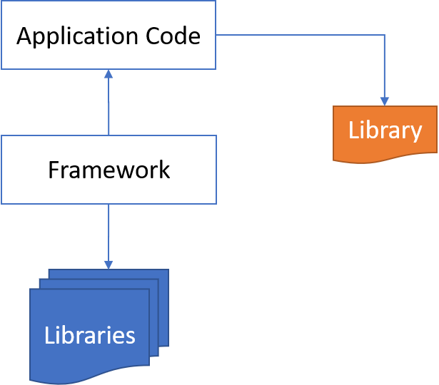
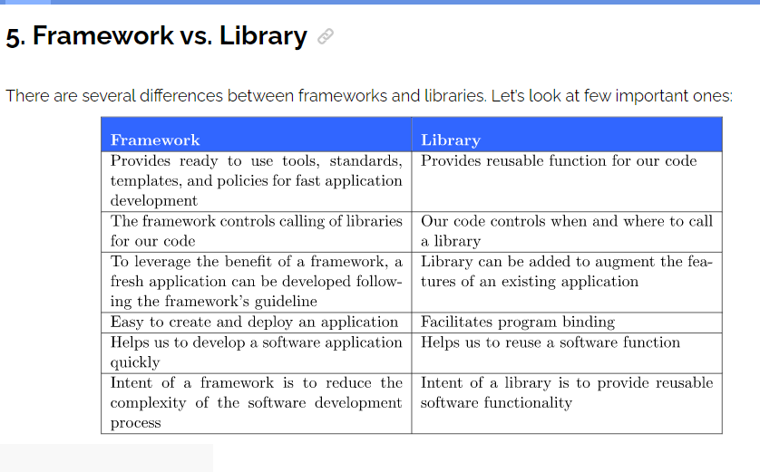

1. # How does express work?

1. # What are routes?
   src:- https://expressjs.com/en/guide/routing.html
1. # What are Middlewares?

   src:- https://expressjs.com/en/guide/using-middleware.html

   Middleware functions are functions that have access to the request object (req), the response object (res), and the next middleware function in the application’s request-response cycle. The next middleware function is commonly denoted by a variable named next.

Middleware functions can perform the following tasks:

Execute any code.
Make changes to the request and the response objects.
End the request-response cycle.
Call the next middleware function in the stack.
If the current middleware function does not end the request-response cycle, it must call next() to pass control to the next middleware function. Otherwise, the request will be left hanging.

1. # What is MVC framework?
   src:- https://developer.mozilla.org/en-US/docs/Glossary/MVC

- Model: Manages data and business logic.
- View: Handles layout and display.
- Controller: Routes commands to the model and view parts.

1. # How do you do validations?

   with example

1. # How do you do static routing?

1. # What are some templating engines?

1. # How do you manage sessions in express?

1. # How do you manage cookies with express?

1. # What are common libraries you work with express?

Cookies, Session Storage, and Local Storage are all mechanisms for storing data on the client side within a user's web browser. However, there are some differences between them:

Cookies:
Cookies are small text files that are sent by a website and stored on the user's computer by the web browser. Cookies are primarily used to store user preferences and login information, and they can be used to track user behavior across different websites. Cookies have an expiration time and can be set to expire when the browser is closed or after a specified time. They can also be set to be accessed only by a specific domain.

Session Storage:
Session Storage is a mechanism that allows web pages to store key/value pairs in the user's browser for the duration of a session. The data stored in Session Storage is available only for the current session, which ends when the user closes the browser window. Session Storage is useful for storing temporary data, such as data entered by a user in a form, that needs to persist across different pages within a website.

Local Storage:
Local Storage is similar to Session Storage, but the data stored in Local Storage persists even after the browser is closed and reopened. Local Storage is useful for storing data that needs to persist across multiple sessions, such as user preferences or application settings. Data stored in Local Storage is available to any page within the same origin (protocol, host, and port), and can be accessed even when the user is offline.

In summary, Cookies are primarily used for user authentication and tracking, Session Storage is used for storing temporary data within a session, and Local Storage is used for persisting data across sessions.

- ## What is Cookies?
- src:- https://www.geeksforgeeks.org/http-cookies/

1. # What is CORS?

   src:- https://blog.knoldus.com/a-guide-to-cors-in-node-js-with-express/#what-is-cors

1. # StatusCode

   

1. # FrameWork and Library

- We can say that a library implements a particular function. Some examples of popular libraries are React, and JQuery.
- We can define a framework as a collection of libraries implementing a particular methodology. Some of the more commonly known frameworks are Angular, Vue, Model View Controller, and Model View Presenter.

src:- https://www.baeldung.com/cs/framework-vs-library#:~:text=In%20this%20tutorial%2C%20we'll,libraries%20implementing%20a%20particular%20methodology.

1. # NodeJs vs Express
   src:- https://www.besanttechnologies.com/what-is-expressjs#:~:text=lifesaver%20for%20programmers.-,Express.,Another%20reason%20to%20use%20Express.
