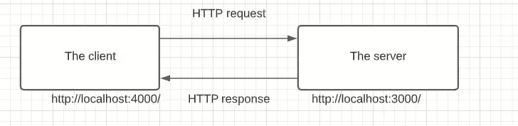

## Explain in brief what is node js?

src:- https://www.techtarget.com/whatis/definition/Nodejs#:~:text=js%20(Node)%3F-,Node.,to%20learn%20an%20additional%20language.

- Node.js (Node) is an open source, cross-platform runtime environment for executing JavaScript code. Node is used extensively for server-side programming, making it possible for developers to use JavaScript for client-side and server-side code without needing to learn an additional language.

## Is Node.js Single-Threaded or Multi-Threaded? and Why?

- src:- https://dev.to/arealesramirez/is-node-js-single-threaded-or-multi-threaded-and-why-ab1

## How is node js non-blocking?

- This is the opposite of the blocking i.e. javascript execution do not wait until the non-javascript operation completes.

- Non-Javascript execution refers to mainly I/O operations. So, in the nutshell, I/O operations are blocking.

- I/O refers primarily to the interaction with the system's disk and network.

- When one of these operations completes, the kernel notifies Node.js and then the appropriate callback is eventually executed.

```javascript
function doTask1() {
  const users = getAllUsers((err, data) => {
    // do something with users here
  });
}

function doTask2() {
  const services = getAllServices((err, data) => {
    // do something with services here
  });
}

// perform some task
doTask1();
doTask2();
```

- Here, getAllUsers and getAllServices now take callbacks. These callbacks are then used by the Node.js and called when the Kernel is finished with the I/O operations.

src:- https://janisharali.com/blog/blocking-and-non-blocking-in-node-js-asynchronous-operations-and-callbacks

```javascript
Asynchronous file read:

const fs = require('fs');
fs.readFile('/file.html', (err, data) => {
 if (err) throw err;
 console.log(data);
});
doSomethingElse(); // will run before console.log
```

## What is throughput?

src:- https://www.scaler.com/topics/throughput-in-computer-networks/

- The number of messages transferred successfully per unit of time is referred to as throughput. Throughput value depends upon many factors such as hardware capabilities, available signal-to-noise ratio, available bandwidth, etc.
- The maximal throughput of a computer network may be greater than the throughput achieved regularly. When various protocol costs are considered, the use rate of the transmitted data can be quite smaller than the maximum throughput achievable.
- Throughput is mostly measured in B.P.S. (Bits Per Second).

### How Do We Measure Network Throughput?

- Suppose there is a highway with a capacity of a maximum of 200 vehicles moving across it at a time. But at an arbitrary instant of time, it was observed that only 150 vehicles move across it. Here 200 vehicles per unit of time is the capacity, also known as bandwidth, but the throughput is 150 vehicles at the very instant of observation.

## How is Node js having high IO throughput?

-

## What are CPU intensive tasks?

- Most of the blocking tasks tend to be CPU-intensive tasks, also known as CPU-bound tasks, with examples like processing graphics, mathematical calculations, and video or image compression.
- In addition to CPU-bound tasks, you will also have I/O-bound tasks, which are non-blocking. These I/O-bound tasks spend most of the time issuing requests to the operating system (OS) and waiting for a response. An example is a network request that the Fetch API makes to a server.
- but it can handle by Promises.

## How can you end up blocking your main thread in node.js?

- the easiest way to block your application is to insert an infinite loop.
- Sync operations
- setInterval:-
  Timers are the best example! If you introduce a simple setInterval inside a script, if you don’t clear this timer, it will run forever, and your program will too.

## What is the event loop?

- src :- https://www.youtube.com/watch?v=8aGhZQkoFbQ&t=1s

## What are different phases in event loop?

-

## What is process.tick?

-

## When can process.tick starve your event loop?

-

## What is the difference between setTimeout and setInterval?

-

## How can you make a network request with http module from the backend?

-

## How can you create your own events?

-

##  

-

## How does your Node.js application handle scale? Elaborate

-

## What is the difference between readFile and readFileSync?

```javascript
console.log("Before readFile");
fs.readFile("./input1.txt", { encoding: "utf8", flag: "r" }, (err, data) => {
  if (err) console.log(err);
  else console.log("readFile:----------", data);
});
console.log("After readFile");

//Blocking
console.log("Before readFileSync");
let data = fs.readFileSync("./input2.txt", { encoding: "utf8", flag: "r" });
console.log("readFileSync-----------:", data);
console.log("After readFileSync");
```

## What are CORS? How do you configure them? Why do you need them?

- ## What is CORS?
- CORS stands for Cross-Origin Resource Sharing. It allows us to relax the security applied to an API. This is done by bypassing the Access-Control-Allow-Origin headers, which specify which origins can access the API.

- In other words, CORS is a browser security feature that restricts cross-origin HTTP requests with other servers and specifies which domains access your resources.

- If you want know more about CORS and it’s policy, you can refer here.

## How CORS works?

An API is a set procedure for two programs to communicate. This means that API resources are consumed by other clients and servers.

Here are two scenarios:

- The CORS same-origin concept
  The client and the server have the same origin. In this example, accessing resources will be successful. You’re trying to access resources on your server, and the same server handles the request.
  

- The CORS cross-origin concept
  The client and server have a different origin from each other, i.e., accessing resources from a different server. In this case, trying to make a request to a resource on the other server will fail.
  

- This is a security concern for the browser. CORS comes into play to disable this mechanism and allow access to these resources. It will add a response header access-control-allow-origins and specify which origins are permitted. CORS ensures that we are sending the right headers.

## What is rate limiting?

-

## How does middle wares work in express?

-

## What is the difference between Encryption and Hashing?

- Encryption:- . For example, websites that transmit credit card and bank account numbers encrypt this information to prevent identity theft and fraud.
- Hash:- Password storing
  

## What is the difference between https and http?

-

## What is TLS?

-

## What is AES?

-

## What is JWT Token? Why do we need to use JWT? What are some pros and cons?

- A token can be defined as a digitally encoded signature used to authenticate and authorize a user to access specific resources on a network.

- A token is always generated in the form of an OTP (One-Time Password), which depicts that it could only be used once and is generated randomly for every transaction.

- The token-based authentication allows users to verify their unique identity, and in return, they receive a unique token that provides access to certain resources for a particular time frame.

- Apart from this, users can easily access the website or network for which the token is issued, and need not enter the credentials again and again until the token expires.

1. HEADER:ALGORITHM & TOKEN TYPE

```javascript
{
  "alg": "HS256",
  "typ": "JWT"
}
```

2. PAYLOAD:DATA

```javascript
{
  "sub": "1234567890",
  "name": "John Doe",
  "iat": 1516239022
}
```

3. VERIFY SIGNATURE

### pros and cons

### Pros of Using Tokens

1. Token-based Authentication is more Scalable and Efficient

- As we know that tokens are required to be stored on the user’s end, they offer a scalable solution.
- Moreover, the server just needs to create and verify the tokens along with the information, which means that maintaining more users on a website or application at once is possible without any hassle.

2. Flexibility and Performance
   Flexibility and enhanced overall performance are other important aspects when it comes to token-based authentication as they can be used across multiple servers and they can offer authentication for diverse websites and applications at once.

3. Tokens Offer Robust Security
   Hence they’re considered the best and the most secure way of offering authentication.

Tokens act as a storage for the user’s credentials and when the token travels between the server, or the web browser, the stored credentials are never compromised.

### Cons of Using Tokens

1. Compromised Secret Key

- One of the major cons of relying on tokens is that it relies on just one key. Yes, JWT uses only one key, which if handled poorly by a developer/administrator, would lead to severe consequences that can compromise sensitive information.

- It’s essential for businesses to seek professional help coupled with robust security mechanisms while planning to add JWT to their authentication mechanism to ensure the highest level of security.

2. Data Overhead

- The overall size of a JWT is quite more than that of a normal session token, which makes it longer whenever more data is added to it.

- So, if you’re adding more information in the token, it will impact the overall loading speed and thus hamper user experience.

- This situation can be fixed if right development practices are followed and minimum but essential data is added to the JWT.

3. Shorter Lifespan

- Short-lived JWT are harder for users to work with. These tokens require frequent reauthorization, which can be annoying at times, especially for the clients.

- Adding refresh tokens and storing them appropriately is the only way to fix this scenario where long-lived refresh tokens can help users stay authorized for a more extended period of time.

## What is salting? Where do we store salt?

-

## What is the difference between authorisation and Authentication?

## Authentication

- Procedure of user identification is called authentication. It is used for verification of the user whether the user is valid or not. The user is provided access to the resources of the network with the help of authentication credentials by comparing credentials with the network database stored credentials information. After acceptance of the authentication, the user is provided with access to the internal resources of the network.

## Authorization

- Following authentication of the user credentials, Authorization is the process of determining what a specific user is allowed to access and do in a network. Categorization of the user is done to identify the operation type they will perform like a guest or an administrator.

## What is the difference between JS on the browser and node?


## What is V8?

- src:- https://www.geeksforgeeks.org/explain-v8-engine-in-node-js/


## Event Loop in Nodejs with proper explination
- In Node.js, the Event Loop is the mechanism that allows asynchronous programming by managing the execution of callback functions. It is responsible for processing and dispatching events to different parts of the application, including I/O operations, timers, and user-defined events.

- The event loop works by constantly monitoring the Node.js event queue for new events to process. When an event is detected, the event loop will first check if there are any pending I/O operations or timers that need to be processed before executing the event. This ensures that the event loop does not block the application from handling other tasks.

- If there are no pending I/O operations or timers, the event loop will execute the event's callback function. Once the callback function completes, any new events generated by the function are added to the event queue, and the event loop starts the process again.

- Here's a step-by-step breakdown of the event loop in Node.js:

1. The event loop starts by checking the Node.js event queue for new events.

2. If there are no events in the queue, the event loop waits for new events to be added.

3. If there are pending I/O operations or timers, the event loop will handle those operations before processing any new events.

4. If there are no pending I/O operations or timers, the event loop will execute the callback function of the next event in the queue.

5. Once the callback function completes, any new events generated by the function are added to the event queue, and the event loop starts again.

6. This cycle continues indefinitely until the application is terminated.

- It's important to note that the event loop is a single-threaded process, meaning that it can only execute one task at a time. However, it can delegate I/O operations to worker threads to improve performance and avoid blocking the main thread.

- While the Event Loop in Node.js and JavaScript is conceptually similar, there are some differences in their implementation.

- In Node.js, the Event Loop is implemented using the libuv library, which provides an abstraction layer over platform-specific I/O operations. This allows Node.js to handle I/O operations in a non-blocking way and delegate them to the operating system's kernel for asynchronous processing.

- In contrast, JavaScript implementations such as web browsers and Node.js' V8 engine rely on the platform's implementation of the Event Loop. This means that the implementation may vary depending on the platform being used.

- Additionally, Node.js provides additional features such as worker threads, which allow developers to delegate CPU-bound tasks to separate threads for better performance. JavaScript implementations do not provide this feature.

- Finally, Node.js also provides several built-in modules and APIs that allow developers to perform I/O operations such as reading and writing files, networking, and streaming data, while JavaScript implementations generally rely on the browser APIs for these operations.

- Overall, while the concept of the Event Loop is the same in both Node.js and JavaScript, the implementation and additional features provided by Node.js make it a powerful tool for building scalable and performant applications.