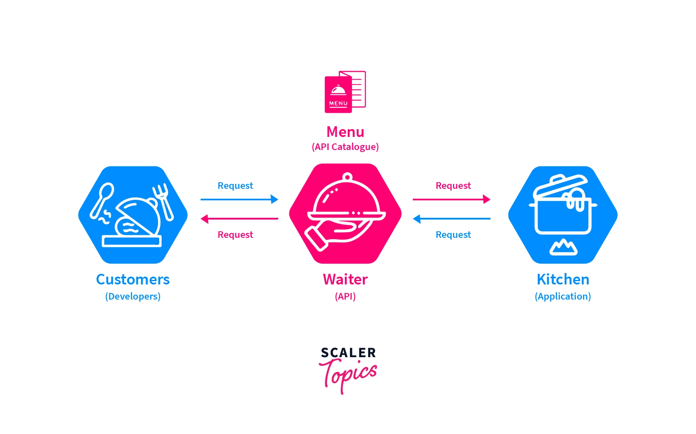
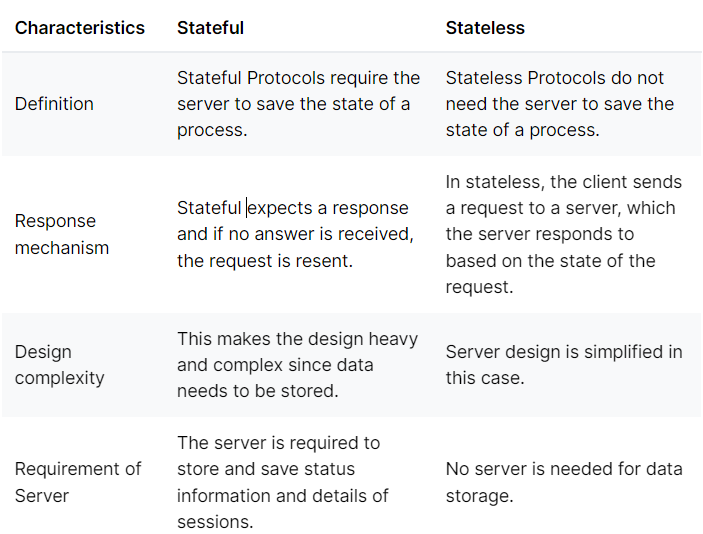
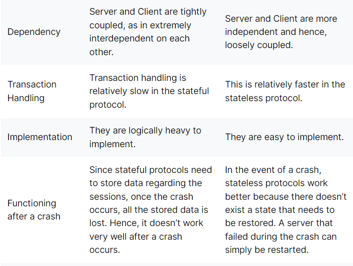
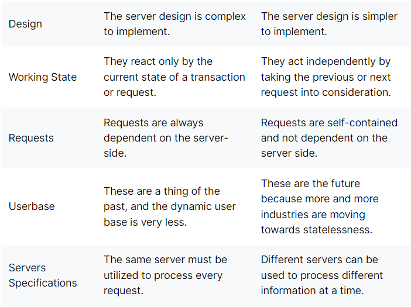
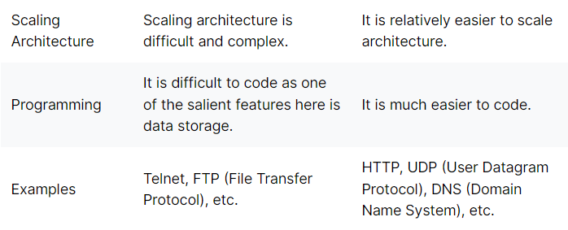
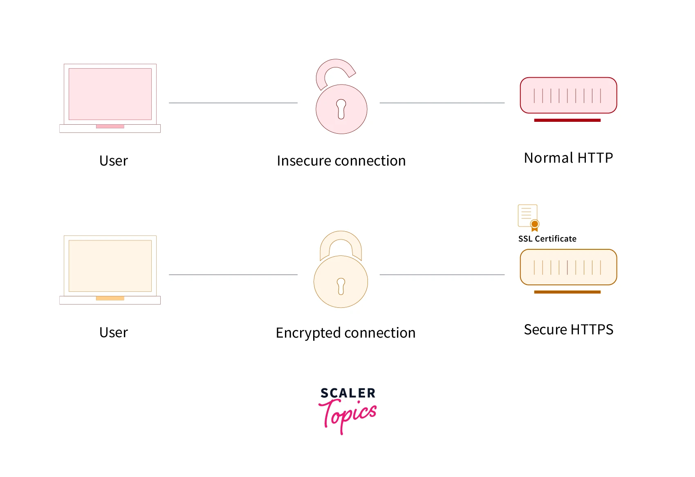
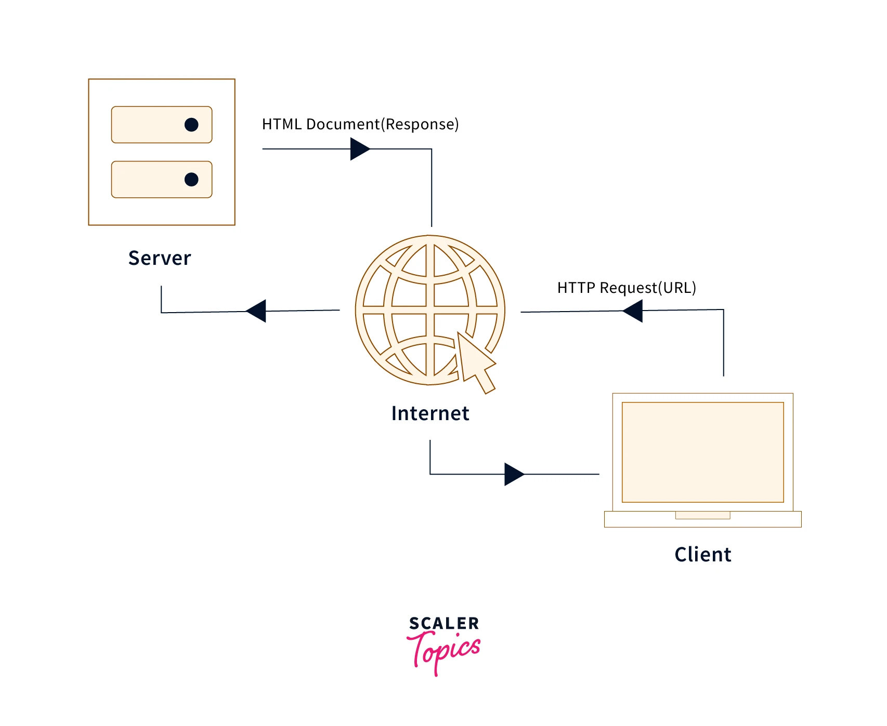

## What is Authentication?

- AAA (Authentication, Authorization, and Accounting) is a framework that allows access to network resources. User identification is the process of authentication and then what resources access is allowed to the user is decided by the authorization. Accounting is used to determine the usage of network resources.

## Authentication

- Procedure of user identification is called authentication. It is used for verification of the user whether the user is valid or not. The user is provided access to the resources of the network with the help of authentication credentials by comparing credentials with the network database stored credentials information. After acceptance of the authentication, the user is provided with access to the internal resources of the network.

## Authorization

- Following authentication of the user credentials, Authorization is the process of determining what a specific user is allowed to access and do in a network. Categorization of the user is done to identify the operation type they will perform like a guest or an administrator.

## Accounting

- Accounting is the procedure of assessing the use of resources of the system by the user, which involves data received, data sent, and login and logout time. The procedure of the accounting includes the session statistics and use data of the logout, and it is used for controlling the authorization, charging and consumption of the resources.

## What is Authorization?

src:- https://www.scaler.com/topics/authentication-authorization-and-accounting/

## How do you do role-based authentication?

- It is a frequently used access control model that limits network access based on the roles of individuals or groups inside an organization. Roles in Role-based access control (RBAC) are based on various factors, including job specialization, responsibility, and authorization. Roles, such as end-user, administrator, or specialist user, are usually assigned by organizations to different individuals. The role-Based Access Control (RBAC) model is mostly used in organizations to grant or decline access to individuals or groups.

## What is hashing?

## What is encryption?

## How is hashing and encryption different?

## What is JWT?

## How is JWT different and list the pros and cons of using JWT tokens?

## What are the different ways to manage authentication?

## What is cookie-based auth?

## What is session management?

## What is REST api?

Introduction to REST API
REST API
Image Source
REST API is an API that follows a set of rules for an application and services to communicate with each other. As it is constrained to REST architecture, REST API is referred to as RESTful API. REST APIs provide a way of accessing web services in a flexible way without massive processing capabilities. Below are the underlying rules of REST API:

1. Statelessness
   - Systems aligning with the REST paradigm are bound to become stateless. For Client-Server communication, stateless constraint enforces servers to remain unaware of the client state and vice-versa. A constraint is applied by using resources instead of commands, and they are nouns of the web that describe any object, document, or thing to store/send to other resources.

2. Cacheable
   - Cache helps servers to mitigate some constraints of statelessness. It is a critical factor that has improved the performance of modern web applications. Caching not only enhances the performance on the client-side but also scales significant results on the server-side. A well-established cache mechanism would drastically reduce the average response time of your server.

3. Client-server Decoupling
   - This principle states that the client and the server components should be isolated from each other. The client should not be able to modify anything on the server-side. The server should not be able to modify anything on the client side. The interaction between the client and the server should always be via the API.

4. Layered
  - A Layered system makes a REST architecture scalable. With RESTful architecture, Client and Server applications are decoupled, so the calls and responses of REST APIs go through different layers. As REST API is layered, it should be designed such that neither Client nor Server identifies its communication with end applications or an intermediary.

Key Benefits of REST API

1. Flexible
   - REST API is flexible with multiple types of calls like return different data formats and change structurally with the correct implementation of hypermedia. It allows users to communicate back and forth with clients and servers, even if they are hosted on different servers.

2. Adaptable
   - REST API is adaptable to any modification done in data that resides in the database, even when hosted on the different back- and front-end servers. Since it depends to a certain extent on codes, it helps synchronize data within websites without any issue.

3. Ease of Understanding
   - Flow of Data using REST APIs
   Image Source
   As REST uses HTTP verbs (GET, POST, PUT or DELETE) methods for communication, these methods are self-explanatory. In addition, REST architecture helps increase developers’ productivity, allowing them to display the information on the client-side and store or manipulate the data on the server-side.

------

SRC:- https://www.scaler.com/topics/what-is-rest-api/
# API:- Application Program Interface
Let’s break this out with a simple and common real-life example.

Consider, you and your friends have gone out for a trip to visit Taj Mahal, you are all totally swept off by its beauty and forget the time totally. Suddenly, one of your friends say he/she is hungry, and every agree with his idea to find a good restaurant nearby. So you check for the nearest restaurant on Google Maps and reach there.

When you go to a restaurant, you don’t enter straight into the kitchen and give your order to the chef present there. You go and sit on a table waiting for a waiter to attend you. A waiter will come to your table, interact with you and get your orders. He will brief you on the menu and the dishes, then take your orders. He will then convey the orders to the chef present in side the kitchen. Once the chef prepares your dishes, the server will then fetch them back to you.

So, How is this anyway related to the question of what is an API? 🤔

## What is an API?

src:-
An Application Program Interface referred to as an API is an architectural style that defines a set of rules to create web services that enable different programs to communicate with one another, transmit data, and integrate with them.

Let’s break this out with the same real-life example.

- In real life--> In our story
- Client--> You/Customer
- API--> Waiter
- Server--> Kitchen/Chef
- Data/Resource--> Food
- Here the person ordering the food, you are the client. The waiter is the API, the kitchen/chef is the server, and the food is the resource requested by the client. When the client needs some resources, it requests them to the server via the API.
  

## Difference between API and REST API?

1. API vs REST API: Structure
  - While structurally, most of the APIs follow the application-application format, REST API strictly operates on the web concept of Client and Server. The Client and Server are separated from one another, giving more flexibility.

2. API vs REST API: Design
   - Generally, APIs are lightweight architectures that are designed for gadgets constrained to devices like smartphones. In contrast, REST APIs communicate over systems, making it a complex architecture.

3. API vs REST API: Protocol
  - The primary goal of API is to standardize data exchange between web services. Depending on the type of API, the choice of protocol changes. On the other hand, REST API is an architectural style for building web services that interact via an HTTP protocol. Although REST API was formulated in 2000 by computer scientist Roy Fielding, it remains the gold standard for public APIs.

4. API vs REST API: Support
   - Most of the API are easy to implement as they do not face statelessness. In contrast, REST API gets executed even if users do not know the function names and the parameters in a specific order.

5. API vs REST API: Uniform Interface
  - Not many API decouples the client from a server or one application from another. REST API adheres to the principles of a uniform interface and forbids the use of self or multiple interfaces within an API. Hypermedia connections should ideally be used to distribute a single interface. It should also ensure that a similar piece of data (for example, a user’s name or email address) belongs to only one uniform resource identifier (URI). As a result, regardless of the initial request, all API requests for the same resources should look the same.

6. API vs REST API: Scalability
   While scalability is an issue for general APIs, REST API has a layered structure, making REST API modular and more flexible to achieve scalability.

## What is a stateless backend?

src:- https://www.interviewbit.com/blog/stateful-vs-stateless/
### StateFul 

### StateLess

## What is GraphQL?

## What is gRPC?

## What is the client server model?

## What is HTTP vs HTTPS?

src:- https://www.scaler.com/topics/difference-between-http-and-https/

- HTTP stands for Hypertext Transfer Protocol. HTTP specifies a set of rules and standards that regulate how any information on the World Wide Web (WWW) can be transmitted. HTTP defines the standard rules by which web browsers and servers communicate.

normal-vs-secure-https

HTTP (Hyper Text Transfer Protocol) is also known as a "stateless protocol" because each transaction is executed independently without having prior knowledge of the transactions. This means that once the transaction between the web browser and the server is completed, the connection is lost.

## What is throughput?

## What is availability?

## What is latency?

## What is Caching?
Caching is the process of storing the most recently used data, so that if it’s requested again it can be accessed from the cache, this saves a lot of time. Since we don’t have to send the request to the server and wait for it to respond to us with the data.

This principle states that every response from the server should be implicitly or explicitly mentioned as cacheable or non-cacheable, i.e., whether it can be cached or not. For cacheable response, the time period for which the response is valid must also be specified.

So, now when a client makes a request, we check for its availability in the local cache. If it's available in the cache, we then check whether the data is still valid, and if it is valid, then the request is not forwarded to the server, the data is just fetched from the local cache. If otherwise, such as not available or not valid, then the request is forwarded to the server.

This increases the scalability of the server, by reducing the workload of repeated and unwanted requests.

## What are ways to cache on the backend?

## What is LRU cache?

## What is rate-limiting?

## What are the different ways to do rate limits?

## What is a load balancer?

## What is the difference between SQL and NoSQL databases?

## What is a web socket?

## Describe how you design an API?

## What is Redis? Why do we use it?

## What is a horizontal and vertical scaling?

## How do you build a system which is reliable?
