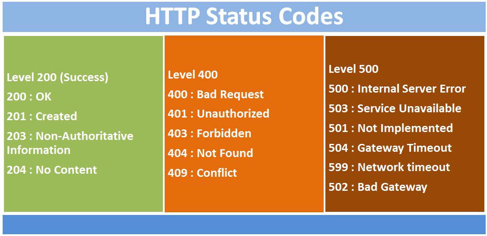

1. # How does express work?
1. # What are routes?
   src:- https://expressjs.com/en/guide/routing.html
1. # What are Middlewares?

   src:- https://expressjs.com/en/guide/using-middleware.html

   Middleware functions are functions that have access to the request object (req), the response object (res), and the next middleware function in the application’s request-response cycle. The next middleware function is commonly denoted by a variable named next.

Middleware functions can perform the following tasks:

Execute any code.
Make changes to the request and the response objects.
End the request-response cycle.
Call the next middleware function in the stack.
If the current middleware function does not end the request-response cycle, it must call next() to pass control to the next middleware function. Otherwise, the request will be left hanging.

1. # What is MVC framework?
   src:- https://developer.mozilla.org/en-US/docs/Glossary/MVC

- Model: Manages data and business logic.
- View: Handles layout and display.
- Controller: Routes commands to the model and view parts.

1. # How do you do validations?
   with example
1. # How do you do static routing?

1. # What are some templating engines?

1. # How do you manage sessions in express?

1. # How do you manage cookies with express?

1. # What are common libraries you work with express?

- ## What is Cookies?
- src:- https://www.geeksforgeeks.org/http-cookies/

1. # What is CORS?

   src:- https://blog.knoldus.com/a-guide-to-cors-in-node-js-with-express/#what-is-cors

1. # StatusCode
   
