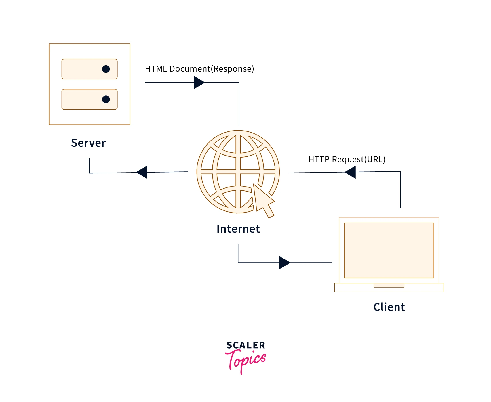
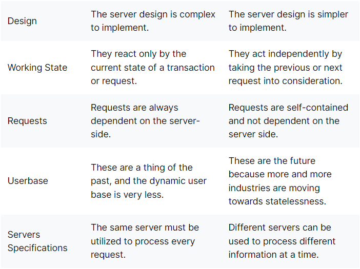
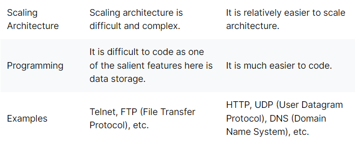

# 1. Explain in brief what is node js?

- Node.js (Node) is an open source, cross-platform runtime environment for executing JavaScript code. Node is used extensively for server-side programming, making it possible for developers to use JavaScript for client-side and server-side code without needing to learn an additional language.

# 2. Event Loop in Nodejs with proper explination

- In Node.js, the Event Loop is the mechanism that allows asynchronous programming by managing the execution of callback functions. It is responsible for processing and dispatching events to different parts of the application, including I/O operations, timers, and user-defined events.

- The event loop works by constantly monitoring the Node.js event queue for new events to process. When an event is detected, the event loop will first check if there are any pending I/O operations or timers that need to be processed before executing the event. This ensures that the event loop does not block the application from handling other tasks.

- If there are no pending I/O operations or timers, the event loop will execute the event's callback function. Once the callback function completes, any new events generated by the function are added to the event queue, and the event loop starts the process again.

- Here's a step-by-step breakdown of the event loop in Node.js:

1. The event loop starts by checking the Node.js event queue for new events.

2. If there are no events in the queue, the event loop waits for new events to be added.

3. If there are pending I/O operations or timers, the event loop will handle those operations before processing any new events.

4. If there are no pending I/O operations or timers, the event loop will execute the callback function of the next event in the queue.

5. Once the callback function completes, any new events generated by the function are added to the event queue, and the event loop starts again.

6. This cycle continues indefinitely until the application is terminated.

- It's important to note that the event loop is a single-threaded process, meaning that it can only execute one task at a time. However, it can delegate I/O operations to worker threads to improve performance and avoid blocking the main thread.

- While the Event Loop in Node.js and JavaScript is conceptually similar, there are some differences in their implementation.

- In Node.js, the Event Loop is implemented using the libuv library, which provides an abstraction layer over platform-specific I/O operations. This allows Node.js to handle I/O operations in a non-blocking way and delegate them to the operating system's kernel for asynchronous processing.

- In contrast, JavaScript implementations such as web browsers and Node.js' V8 engine rely on the platform's implementation of the Event Loop. This means that the implementation may vary depending on the platform being used.

- Additionally, Node.js provides additional features such as worker threads, which allow developers to delegate CPU-bound tasks to separate threads for better performance. JavaScript implementations do not provide this feature.

- Finally, Node.js also provides several built-in modules and APIs that allow developers to perform I/O operations such as reading and writing files, networking, and streaming data, while JavaScript implementations generally rely on the browser APIs for these operations.

- Overall, while the concept of the Event Loop is the same in both Node.js and JavaScript, the implementation and additional features provided by Node.js make it a powerful tool for building scalable and performant applications.

## 2.1 What are CPU intensive tasks?

- Most of the blocking tasks tend to be CPU-intensive tasks, also known as CPU-bound tasks, with examples like processing graphics, mathematical calculations, and video or image compression.
- In addition to CPU-bound tasks, you will also have I/O-bound tasks, which are non-blocking. These I/O-bound tasks spend most of the time issuing requests to the operating system (OS) and waiting for a response. An example is a network request that the Fetch API makes to a server.
- but it can handle by Promises.

## 2.2 What are IO operation in Nodejs?

- Input/output (IO) operations in Node.js refer to the process of reading or writing data to and from external sources, such as files, databases, network sockets, or other streams.

- In Node.js, IO operations are typically asynchronous, meaning that they do not block the execution of the main thread, and instead use callbacks or promises to handle the results of the operation when they become available. This allows Node.js to handle a large number of concurrent connections and IO-bound tasks efficiently, without wasting resources on blocking operations.

- Some common examples of IO operations in Node.js include:

1. Reading and writing files using the fs module
2. Interacting with databases using the appropriate database driver
3. Making HTTP requests using the http or https module
4. Working with streams of data, such as reading from or writing to network sockets, standard input/output, or other sources.

- It's important to note that since IO operations involve interacting with external resources, they can be slower and more prone to errors than purely computational tasks. As such, it's important to write robust error handling and use appropriate techniques to optimize IO-bound code in Node.js.

## 2.3 What is libuv library and kernel?

- Libuv is a multi-platform C library that provides asynchronous event-driven IO operations for Node.js and other applications. It was developed by the Node.js core team to handle IO operations in a cross-platform way, and is used by Node.js to implement its event loop.

- The event loop in Node.js is responsible for handling IO operations and other asynchronous events, such as timers and callbacks. When an IO operation is initiated in Node.js, it is delegated to libuv, which uses platform-specific mechanisms, such as epoll on Linux or kqueue on macOS, to monitor the IO events and notify Node.js when the operation is ready to be processed.

- One of the main advantages of using libuv and the event loop in Node.js is that it allows for non-blocking IO operations, which means that Node.js can handle multiple IO operations simultaneously without blocking the execution of other tasks. This is especially important for server-side applications that need to handle a large number of concurrent connections.

- In addition to providing IO operations, libuv also includes other features that are useful for building high-performance applications, such as:

1. Thread pool for offloading CPU-intensive tasks
2. Signal handling for managing system signals
3. File system watching for monitoring file changes

- The use of libuv and the event loop is a key feature of Node.js that allows it to handle IO operations efficiently and with low overhead. By leveraging these technologies, Node.js is able to provide a scalable and high-performance platform for building server-side applications.

### What about kernel ?

- The kernel is the core component of an operating system that manages system resources and provides a layer of abstraction between the hardware and the applications running on top of it. It is responsible for managing memory, CPU scheduling, input/output operations, and other low-level functions.

- In the context of Node.js and libuv, the kernel is important because it provides the underlying mechanisms that libuv uses to monitor IO events and notify Node.js when IO operations are ready to be processed. For example, on Linux, the epoll mechanism provided by the kernel is used to monitor file descriptors and notify libuv when IO events occur. Similarly, on macOS, the kqueue mechanism is used for the same purpose.

- By using these mechanisms provided by the kernel, Node.js and libuv are able to efficiently handle IO operations and other asynchronous events without wasting resources on polling or blocking operations. This allows Node.js to achieve high performance and scalability, which are key features for building server-side applications.

- In summary, the kernel is an essential component of the operating system that provides low-level mechanisms for managing system resources and IO operations. In the context of Node.js and libuv, it is used to implement asynchronous IO operations and the event loop, which are key features for building scalable and high-performance applications.

## 2.4 How is node js non-blocking?

### NON-BLOCKING

- By default, Node.js uses a non-blocking I/O model, where I/O operations are performed asynchronously without blocking the main thread of execution.
- This means that when an I/O operation is executed, the program continues to execute other tasks while waiting for the I/O operation to complete.
- This non-blocking behavior is achieved through the use of :

  - callbacks,
  - promises, and
  - async/await functions.

### BLOCKING

- Blocking behavior can occur when using certain synchronous I/O methods in Node.js.
- Synchronous methods block the main thread until the operation is completed, preventing the program from executing any other tasks until the operation is finished.
- This can lead to delays and decreased performance if many synchronous I/O operations need to be executed.

-

## 2.5 Is Node.js Single-Threaded or Multi-Threaded? and Why?

- src:- https://dev.to/arealesramirez/is-node-js-single-threaded-or-multi-threaded-and-why-ab1

## 2.6 How does your Node.js application handle scale? Elaborate.

# 3. What are different phases in event loop?

1. Timers: This phase is responsible for executing callbacks that were scheduled using setTimeout() and setInterval().

2. I/O callbacks: This phase is responsible for executing callbacks that are related to I/O operations, such as reading from a file or receiving data from a network socket. This includes callbacks registered using fs.readFile(), http.get(), process.nextTick(), and setImmediate().

   2.1. process.nextTick() is executed immediately after the current operation completes, before the event loop continues to the next phase. This means that any callbacks registered with process.nextTick() are executed before any I/O or timers are processed.

   2.2. setImmediate() is executed in the Check phase of the event loop, after any I/O callbacks have been processed. This means that any callbacks registered with setImmediate() will be executed before the next I/O polling phase.

3. Idle, prepare: These are internal phases that are not typically used in user code.

4. Poll: This phase is responsible for polling I/O events, such as waiting for a network socket to receive data or for a file to be ready for reading. This phase also executes any callbacks that were registered using setImmediate().

5. Check: This phase is responsible for executing callbacks that were scheduled using setImmediate().

6. Close callbacks: This phase is responsible for executing callbacks that were registered using socket.on('close', ...) or httpServer.on('close', ...).

- It is important to note that the order in which callbacks are executed within each phase is determined by the order in which they were added to the event loop. This means that if you have multiple callbacks that are registered for the same phase, the order in which they execute may not be predictable.

- In general, you should try to write your code in a way that minimizes blocking and maximizes asynchronous I/O, to ensure that the event loop can execute as efficiently as possible. You should also be aware of the tools that are available to you, such as setTimeout(), setInterval(), fs.readFile(), http.get(), process.nextTick(), setImmediate(), and socket.on('close', ...). By using these tools effectively, you can write Node.js applications that are highly responsive and efficient.

## 3.1 What is process.tick?

- The process.nextTick() method in Node.js is a special type of asynchronous function that allows you to defer the execution of a callback until the next iteration of the event loop.

When you call process.nextTick(), the callback function that you pass as an argument is added to the front of the event queue. This means that it will be executed as soon as possible, even before any I/O operations or timers that are scheduled for the current iteration of the event loop.

Here's an example of how you might use process.nextTick():

```javascript
console.log("start");

process.nextTick(() => {
  console.log("nextTick callback");
});
console.log("end");
```

- In this example, the console.log('start') and console.log('end') statements will be executed synchronously, in order. However, the callback function that is passed to process.nextTick() will be executed asynchronously, as soon as the current operation completes and the event loop starts a new iteration.

- The process.nextTick() method is often used in Node.js applications to break up long-running operations and to ensure that callbacks are executed as soon as possible. However, it's important to be careful when using process.nextTick() to avoid blocking the event loop and causing your application to become unresponsive.

## 3.2 When can process.tick starve your event loop?

-

## 3.3 What is the difference between setTimeout and setInterval?

1. setTimeout() and setInterval() are both methods in JavaScript that allow you to schedule the execution of a function after a certain amount of time has passed. However, there are some important differences between the two:

2. setTimeout() schedules a function to be executed once after a specified delay, while setInterval() schedules a function to be executed repeatedly at a specified interval.

3. When you call setTimeout(), you pass in the amount of time that you want to delay the execution of the function, in milliseconds. When the delay has elapsed, the function is added to the event queue and will be executed as soon as possible, but there is no guarantee about exactly when it will be executed.

4. When you call setInterval(), you pass in the amount of time that you want to wait between each execution of the function, in milliseconds. The function is executed repeatedly at that interval until you call clearInterval() to cancel the interval.

5. Because setInterval() schedules a function to be executed repeatedly, it can lead to performance issues if the function takes a long time to execute, or if the interval is set too short. This can cause the event queue to become backlogged and can slow down your application.

6. Here's an example of how you might use setTimeout() and setInterval():

```javascript
// Using setTimeout
console.log("start");

setTimeout(() => {
  console.log("callback");
}, 1000);

console.log("end");

// Using setInterval
let count = 0;

const intervalId = setInterval(() => {
  console.log(`Count: ${count}`);
  count++;

  if (count >= 5) {
    clearInterval(intervalId);
  }
}, 1000);
```

- In this example, the console.log('start') and console.log('end') statements are executed synchronously, in order. The callback function that is passed to setTimeout() will be executed asynchronously after a delay of 1000 milliseconds, and the console.log('callback') statement will be printed to the console.

- The setInterval() function is used to execute a function repeatedly at an interval of 1000 milliseconds, printing the value of count to the console each time. The interval is cancelled after count reaches 5, using the clearInterval() function.

# 4.

- CORS stands for Cross-Origin Resource Sharing, which is a security mechanism implemented in web browsers that restricts web pages from making requests to a different domain than the one that served the page. It is a security measure to prevent malicious websites from stealing sensitive data or executing actions on behalf of the user without their knowledge or consent.

- When a web page tries to make a cross-origin request (i.e., a request to a different domain), the browser sends a preflight request to the server to ask for permission to make the request. The server responds with headers that indicate whether the request is allowed or not.

- To configure CORS, you need to set the appropriate headers in the HTTP response from the server. The most important headers are:

## 1. Access-Control-Allow-Origin: specifies which domains are allowed to make cross-origin requests to the server.

## 2. Access-Control-Allow-Methods: specifies which HTTP methods are allowed for cross-origin requests.

## 3. Access-Control-Allow-Headers: specifies which HTTP headers are allowed for cross-origin requests.

- Here's an example of how you might configure CORS in a Node.js application using the cors package:

```javascript
const express = require("express");
const cors = require("cors");

const app = express();

// Enable CORS for all routes
app.use(cors());

// Enable CORS for a specific route
app.get("/api/users", cors(), (req, res) => {
  // ...
});
```

- In this example, the cors package is used to enable CORS for all routes in the express app. You can also enable CORS for specific routes by passing the cors middleware function as an argument to the route handler.

- You need CORS to allow web pages to make cross-origin requests to your server, which is necessary when building web applications that consume APIs from different domains. Without CORS, the browser will block these requests, which can prevent your application from functioning correctly.

# 4. What are CORS? How do you configure them? Why do you need them?

- ## What is CORS?
- CORS stands for Cross-Origin Resource Sharing. It allows us to relax the security applied to an API. This is done by bypassing the Access-Control-Allow-Origin headers, which specify which origins can access the API.

- In other words, CORS is a browser security feature that restricts cross-origin HTTP requests with other servers and specifies which domains access your resources.

- If you want know more about CORS and it’s policy, you can refer here.

## How CORS works?

An API is a set procedure for two programs to communicate. This means that API resources are consumed by other clients and servers.

Here are two scenarios:

- The CORS same-origin concept
  The client and the server have the same origin. In this example, accessing resources will be successful. You’re trying to access resources on your server, and the same server handles the request.
  

- The CORS cross-origin concept
  The client and server have a different origin from each other, i.e., accessing resources from a different server. In this case, trying to make a request to a resource on the other server will fail.
  

- This is a security concern for the browser. CORS comes into play to disable this mechanism and allow access to these resources. It will add a response header access-control-allow-origins and specify which origins are permitted. CORS ensures that we are sending the right headers.

# 5. What is JWT Token? Why do we need to use JWT? What are some pros and cons?

- A token can be defined as a digitally encoded signature used to authenticate and authorize a user to access specific resources on a network.

- A token is always generated in the form of an OTP (One-Time Password), which depicts that it could only be used once and is generated randomly for every transaction.

- The token-based authentication allows users to verify their unique identity, and in return, they receive a unique token that provides access to certain resources for a particular time frame.

- Apart from this, users can easily access the website or network for which the token is issued, and need not enter the credentials again and again until the token expires.

1. HEADER:ALGORITHM & TOKEN TYPE

```javascript
{
  "alg": "HS256",
  "typ": "JWT"
}
```

2. PAYLOAD:DATA

```javascript
{
  "sub": "1234567890",
  "name": "John Doe",
  "iat": 1516239022
}
```

3. VERIFY SIGNATURE

## Pros of Using Tokens

1. Token-based Authentication is more Scalable and Efficient

- As we know that tokens are required to be stored on the user’s end, they offer a scalable solution.
- Moreover, the server just needs to create and verify the tokens along with the information, which means that maintaining more users on a website or application at once is possible without any hassle.

2. Flexibility and Performance
   Flexibility and enhanced overall performance are other important aspects when it comes to token-based authentication as they can be used across multiple servers and they can offer authentication for diverse websites and applications at once.

3. Tokens Offer Robust Security
   Hence they’re considered the best and the most secure way of offering authentication.

Tokens act as a storage for the user’s credentials and when the token travels between the server, or the web browser, the stored credentials are never compromised.

## Cons of Using Tokens

1. Compromised Secret Key

- One of the major cons of relying on tokens is that it relies on just one key. Yes, JWT uses only one key, which if handled poorly by a developer/administrator, would lead to severe consequences that can compromise sensitive information.

- It’s essential for businesses to seek professional help coupled with robust security mechanisms while planning to add JWT to their authentication mechanism to ensure the highest level of security.

2. Data Overhead

- The overall size of a JWT is quite more than that of a normal session token, which makes it longer whenever more data is added to it.

- So, if you’re adding more information in the token, it will impact the overall loading speed and thus hamper user experience.

- This situation can be fixed if right development practices are followed and minimum but essential data is added to the JWT.

3. Shorter Lifespan

- Short-lived JWT are harder for users to work with. These tokens require frequent reauthorization, which can be annoying at times, especially for the clients.

- Adding refresh tokens and storing them appropriately is the only way to fix this scenario where long-lived refresh tokens can help users stay authorized for a more extended period of time.

# 6. What is the difference between authorization and Authentication?

src:- https://www.scaler.com/topics/authentication-authorization-and-accounting/

## Authentication

- Procedure of user identification is called authentication. It is used for verification of the user whether the user is valid or not. The user is provided access to the resources of the network with the help of authentication credentials by comparing credentials with the network database stored credentials information. After acceptance of the authentication, the user is provided with access to the internal resources of the network.

## Authorization

- Following authentication of the user credentials, Authorization is the process of determining what a specific user is allowed to access and do in a network. Categorization of the user is done to identify the operation type they will perform like a guest or an administrator.

## 6.1 How do you do role-based authentication (RBAC)?

- Role-based authentication is a security mechanism that enables access control based on the roles of individual users within an organization or system. Here are some steps to implement role-based authentication:

1. Define Roles: Start by defining the roles within your organization or system. Determine what each role can access, modify, or delete. It's important to be specific and precise.

2. Assign Roles: Assign each user a role based on their job responsibilities, skills, and knowledge. Ensure that each user has only one role and that their role reflects their job function.

3. Implement Authentication: Implement an authentication mechanism that requires users to enter their login credentials, such as username and password, to access the system. This ensures that only authorized users can log in.

4. Authorize Access: Once the user has been authenticated, the system should verify their role to determine what they are allowed to access. If a user tries to access an area they are not authorized to access, the system should deny them access.

5. Monitor Activity: Keep track of user activity within the system to detect any unusual behavior or security breaches. This will help you identify and address any potential security issues.

6. Review and Update Roles: Periodically review and update the roles and permissions of your users to ensure that they are still relevant and appropriate. This will help you stay on top of any changes in your organization and ensure that your security policies are up-to-date.

- Overall, implementing a role-based authentication system can help you enforce access control and ensure that your organization's data is secure.

## 6.2 What are the different ways to manage authentication?

1. Username and password: This is the most common method of authentication. Users enter a username and password to access a system. However, it can be vulnerable to hacking and phishing attacks.

2. Two-Factor Authentication (2FA): 2FA is a method that requires users to enter two forms of authentication to access a system. This can include a password and a unique code generated by an app, a text message, or a physical token.

3. Multi-Factor Authentication (MFA): MFA is similar to 2FA, but it requires users to provide more than two forms of authentication. For example, it may require a password, a fingerprint, and a security question.

4. Single Sign-On (SSO): SSO allows users to log in to multiple systems using a single set of login credentials. This can reduce the number of usernames and passwords users need to remember.

5. Biometric authentication: Biometric authentication uses physical characteristics, such as fingerprints or facial recognition, to verify a user's identity. This method can be secure but may require specialized hardware.

6. Social login: Social login allows users to access a system using their social media account, such as Facebook or Google. This can be convenient for users, but it also requires giving third-party applications access to personal information.

- Overall, it's essential to select the appropriate authentication method based on the level of security required and the user's convenience. A combination of different authentication methods may also provide stronger security.

# 7. What is the difference between JS on the browser and node?


# 8. What is REST api? What is RESTful then ?

- REST (Representational State Transfer) is a software architectural style for building web services. It is based on HTTP protocols and emphasizes the use of standard HTTP methods (such as GET, POST, PUT, DELETE) to manipulate resources, which are identified by unique URLs or URIs (Uniform Resource Identifiers). RESTful APIs (Application Programming Interfaces) are designed to be scalable, reliable, and easy to maintain.

  -REST API is an API that follows a set of rules for an application and services to communicate with each other. As it is constrained to REST architecture, REST API is referred to as RESTful API. REST APIs provide a way of accessing web services in a flexible way without massive processing capabilities

- A RESTful API is one that conforms to the principles of REST. In addition to using HTTP methods and URLs to manipulate resources, a RESTful API should also adhere to the following constraints:

1. Client-server architecture: The API should have a clear separation between the client (the application making the request) and the server (the application processing the request).

2. Statelessness: Each request should contain all the information necessary for the server to fulfill the request, and the server should not rely on any information from previous requests.

3. Cacheability: Responses should be able to be cached by the client or any intermediary network components to improve performance.

4. Layered system: A Layered system makes a REST architecture scalable. With RESTful architecture, Client and Server applications are decoupled, so the calls and responses of REST APIs go through different layers. As REST API is layered, it should be designed such that neither Client nor Server identifies its communication with end applications or an intermediary.

5. Uniform interface: The API should use a uniform interface that is standardized and easy to understand, so that clients can interact with the API without needing to know about the implementation details.

Overall, a RESTful API is a web service that follows the principles of the REST architectural style, which enables easy communication between different systems over the internet.

## 8.1 Difference between API and REST API?

### API:

1. Stands for Application Programming Interface
2. A set of protocols, routines, and tools that enable different software components to communicate with each other
3. Does not necessarily follow any specific constraints
4. Can use any communication protocol, such as TCP/IP, HTTP, or FTP
5. Can use any message format, such as XML, JSON, or SOAP
6. Can be synchronous or asynchronous
7. Can be used for various types of applications, such as desktop, mobile, or web-based applications

### REST API:

1. Stands for Representational State Transfer API
2. A specific type of API that adheres to the constraints of the REST architectural style
3. Uses HTTP protocol and HTTP methods (GET, POST, PUT, DELETE, etc.) to interact with resources
4. Uses HTTP status codes to indicate the success or failure of a request
5. Uses URLs to identify resources
6. Supports stateless communication, meaning each request is independent of any previous requests
7. Uses a uniform interface for communication, allowing for simpler and more standardized interactions
8. Well-suited for web-based applications and mobile applications that need to access web services.

# 8.2 Keys Benefits of using RESTful API's

1. Scalability: RESTful APIs are highly scalable because they are stateless, which means that each request contains all the information necessary to complete the request. This makes it easy to add or remove resources as needed.

2. Flexibility: RESTful APIs are flexible because they can support a wide range of data formats, including XML, JSON, and plain text. This makes it easy to integrate with different systems and platforms.

3. Simplified architecture: RESTful APIs use a simple and standardized architecture that is easy to understand and implement. This makes it easy for developers to build and maintain web services.

4. Improved performance: RESTful APIs are designed to be lightweight and fast, which makes them well-suited for mobile and web applications. By reducing the amount of data transmitted over the network, RESTful APIs can improve application performance.

5. Easy caching: RESTful APIs are designed to take advantage of caching mechanisms, which can improve application performance by reducing the number of requests sent to the server.

6. Security: RESTful APIs can be secured using standard security protocols like OAuth2, SSL/TLS, and JWT tokens. This makes it easy to build secure web services.

# 9. What is HTTP vs HTTPS?

src:- https://www.scaler.com/topics/difference-between-http-and-https/

- HTTP stands for Hypertext Transfer Protocol. HTTP specifies a set of rules and standards that regulate how any information on the World Wide Web (WWW) can be transmitted. HTTP defines the standard rules by which web browsers and servers communicate.

normal-vs-secure-https


HTTP (Hyper Text Transfer Protocol) is also known as a "stateless protocol" because each transaction is executed independently without having prior knowledge of the transactions. This means that once the transaction between the web browser and the server is completed, the connection is lost.

## 9.1 What is SSL/TLS?

- SSL stands for Secure Sockets Layer, which is a protocol designed to provide secure communication over the internet. It was developed by Netscape in the mid-1990s and has since been replaced by the newer Transport Layer Security (TLS) protocol, though the term SSL is still commonly used to refer to both protocols.

- SSL/TLS provides encryption and authentication mechanisms that ensure the confidentiality and integrity of data transmitted between a client (such as a web browser) and a server (such as a website). When a user connects to a website that uses SSL/TLS, their browser and the server perform a "handshake" process to establish a secure connection. This involves exchanging certificates to verify the identities of both parties, negotiating encryption algorithms, and generating a shared secret key that is used to encrypt and decrypt data.

- SSL/TLS is commonly used for securing web traffic, such as online transactions and sensitive information exchange, but it can also be used for other types of network communication, such as email, messaging, and virtual private networks (VPNs).

# 9.3 How can you make a network request with http module from the backend?

- To make a network request with the http module from the backend, you can use the following steps:

- First, you need to import the http module:

```javascript
const http = require("http");
```

- Next, you can create an instance of the http module using the http.createServer() method:

```javascript
const server = http.createServer();
```

- You can then make a network request using the http.request() method. For example, to make a GET request to the Google homepage, you can use the following code:

```javascript
const options = {
  hostname: "www.google.com",
  port: 80,
  path: "/",
  method: "GET",
};

const req = http.request(options, (res) => {
  console.log(`statusCode: ${res.statusCode}`);

  res.on("data", (d) => {
    process.stdout.write(d);
  });
});

req.on("error", (error) => {
  console.error(error);
});

req.end();
```

- In this example, we specify the hostname, port, path, and method for the request using the options object. We then create the request using the http.request() method, passing in the options object and a callback function that will be called when the response is received.

- The req.on('error') method is used to handle any errors that may occur during the request.

- Finally, we call the req.end() method to actually send the request.

# 10. What is a stateless backend?

src:- https://www.interviewbit.com/blog/stateful-vs-stateless/





# 11. What is Caching?

Caching is the process of storing the most recently used data, so that if it’s requested again it can be accessed from the cache, this saves a lot of time. Since we don’t have to send the request to the server and wait for it to respond to us with the data.

This principle states that every response from the server should be implicitly or explicitly mentioned as cacheable or non-cacheable, i.e., whether it can be cached or not. For cacheable response, the time period for which the response is valid must also be specified.

So, now when a client makes a request, we check for its availability in the local cache. If it's available in the cache, we then check whether the data is still valid, and if it is valid, then the request is not forwarded to the server, the data is just fetched from the local cache. If otherwise, such as not available or not valid, then the request is forwarded to the server.

This increases the scalability of the server, by reducing the workload of repeated and unwanted requests.

## 11.1 What are ways to cache on the backend?

-

## 11.2 What are ways to cache on the frontend?

-

## 11.3 What is LRU cache?

-

# 12. What is the difference between Encryption and Hashing?

- Encryption:- . For example, websites that transmit credit card and bank account numbers encrypt this information to prevent identity theft and fraud.
- Hash:- Password storing
  

# 13. What is the difference between readFile and readFileSync?

- readFile and readFileSync are both methods in Node.js used to read data from a file. However, they differ in the way they operate:

1. readFile is an asynchronous method, which means it does not block the event loop while the file is being read. It takes a callback function as an argument, which is called once the file has been read.

```javascript
const fs = require("fs");

fs.readFile("file.txt", (err, data) => {
  if (err) throw err;

  console.log(data.toString());
});
```

- In this example, the readFile method is used to read the contents of the file 'file.txt' asynchronously. The callback function is called with two arguments: an error (if any), and the data read from the file.

2. readFileSync is a synchronous method, which means it blocks the event loop until the file has been read. It returns the contents of the file as a Buffer or a string.

```javascript
const fs = require("fs");

const data = fs.readFileSync("file.txt");
console.log(data.toString());
```

- In this example, the readFileSync method is used to read the contents of the file 'file.txt' synchronously. The contents of the file are returned as a Buffer, which is then converted to a string using the toString() method.

- The main difference between these two methods is that readFileSync blocks the event loop, while readFile does not. Asynchronous methods like readFile are generally preferred in Node.js because they allow the event loop to continue processing other requests while the file is being read, which can lead to better performance and scalability in applications that handle many concurrent requests. However, there may be situations where synchronous methods like readFileSync are more appropriate, such as in scripts or command-line tools where performance is not a critical factor.

# 14. Describe how you design an API?

- Designing an API involves several steps, from defining the requirements to documenting the endpoints. Here is a general process for designing an API:

1. Define the requirements: Start by defining what the API should do, what data it should return, and what endpoints it should have. Think about the users of the API and what their needs are. Consider the use cases and user scenarios.

2. Choose the right architecture: Choose the architecture that best fits the requirements. Some popular architectures include REST, GraphQL, and RPC.

3. Define the data model: Define the data model for the API, including the data structures, data types, and relationships between entities.

4. Design the endpoints: Design the endpoints for the API. Each endpoint should correspond to a specific action or resource. Use HTTP methods to define the actions (GET, POST, PUT, DELETE, etc.). Consider the URI structure and naming conventions.

5. Choose the response format: Choose the format for the response data. Common formats include JSON, XML, and CSV.

6. Design the authentication and authorization: Design the authentication and authorization mechanism for the API. Choose a method that best fits the requirements and use cases.

7. Document the API: Document the API using a format such as OpenAPI (formerly Swagger) or RAML. The documentation should include the endpoints, parameters, responses, and examples.

8. Test the API: Test the API to make sure it works as expected. Use tools such as Postman or curl to test the endpoints.

9. Deploy the API: Deploy the API to a production environment. Choose a hosting provider that meets the requirements and can handle the expected traffic.

10. Monitor the API: Monitor the API to detect issues and performance problems. Use tools such as logs, metrics, and alerts to monitor the API and identify issues early.

- Designing an API is an iterative process that requires collaboration between the developers, designers, and stakeholders. It is important to gather feedback and refine the design as needed.

## 14.1 What is GraphQL?

- GraphQL is a query language for APIs that was developed by Facebook. It allows clients to define the structure of the data they need, and the server returns only that data, reducing the amount of over-fetching and under-fetching of data. GraphQL allows for a more efficient and flexible way of accessing data, as well as reducing the number of API requests needed.

- Yes, GraphQL can be used in Node.js. There are several libraries available that allow you to build GraphQL APIs in Node.js, including Apollo Server, GraphQL Yoga, and express-graphql. These libraries make it easy to create and deploy GraphQL APIs, as well as handle authentication, caching, and other features. Additionally, Node.js's non-blocking I/O model makes it well-suited for building high-performance GraphQL APIs.

### Examples

Sure, here are some examples of GraphQL APIs that can be built using Node.js:

1. E-commerce API: A GraphQL API for an e-commerce platform can allow customers to query for products, view their details, add them to their cart, and place an order.

2. Social media API: A GraphQL API for a social media platform can allow users to query for posts, view their details, like, comment or share them, and follow other users.

3. Fitness tracker API: A GraphQL API for a fitness tracker app can allow users to query for their workout history, view their progress, and set goals for the future.

4. Weather API: A GraphQL API for a weather app can allow users to query for the current weather conditions, view the forecast for the next few days, and get alerts for severe weather events.

5. Recipe API: A GraphQL API for a recipe app can allow users to query for recipes, view their details, and filter by ingredients or dietary restrictions.

- These are just a few examples, and the possibilities for building GraphQL APIs in Node.js are endless!

## 14.2.1 Difference between REST and GraphQL

- Whether to use GraphQL or REST depends on the specific requirements of your application. Here are some factors to consider:

1. Data complexity: GraphQL is more suitable for applications with complex data requirements, as it allows clients to request only the data they need, reducing over-fetching and under-fetching of data. REST is better suited for simpler data requirements.

2. Client needs: If your clients require flexibility in how they retrieve data, such as being able to query for related data in a single request, then GraphQL may be a better fit. However, if your clients have strict data requirements and can make do with a fixed set of endpoints, then REST may be more suitable.

3. Server-side performance: REST is generally more performant on the server-side, as it caches responses and has simpler query execution. However, GraphQL can be more performant on the client-side, as it reduces the number of API requests needed.

4. Tooling and community support: Both GraphQL and REST have extensive tooling and community support, but REST has been around for longer and has more mature tooling and support.

- Overall, both GraphQL and REST are valid options for building APIs, and the choice between them will depend on the specific requirements of your application. If you are building an application with complex data requirements, and need flexibility in how you retrieve data, then GraphQL may be the better choice. Otherwise, REST may be more suitable.

## 14.2 What is gRPC?

# 15. What is Redis? Why do we use it?

- Redis is an open-source, in-memory data structure store. It can be used as a database, cache, and message broker. Redis is known for its high performance and versatility, making it a popular choice for building scalable and real-time applications.

Here are some common use cases for Redis:

1. Caching: Redis can be used as an in-memory cache to improve the performance of applications by reducing the number of times data needs to be fetched from the database. Redis allows for the storage and retrieval of frequently used data in memory, resulting in faster access times.

2. Session storage: Redis can be used as a session store to store user sessions in memory, rather than on disk. This allows for faster session access times and can improve application performance.

3. Pub/Sub messaging: Redis supports a Publish/Subscribe (Pub/Sub) messaging pattern, allowing applications to communicate with each other in real-time. This can be useful for building real-time applications, such as chat applications or real-time analytics.

4. Queues: Redis can be used as a message queue to manage background jobs, such as sending emails or processing large amounts of data. Redis can also be used as a task queue for distributing workloads across multiple workers.

5. Leaderboards and rankings: Redis supports data structures such as sorted sets, which can be used to build leaderboards and rankings.

- Overall, Redis is a powerful tool for building high-performance, scalable applications that require fast data access times and real-time messaging capabilities.

# 16. Optimization

## 16.1 If our website have an error from where i should start front end or backewnd give step procedure of this +

- step-by-step procedure you can follow:

1. Check the error message: If there is an error message displayed on the website, read it carefully to determine if it is related to the front-end or back-end. If the error message refers to a specific file or line number, it may be easier to identify the source of the error.

2. Check the browser console: If the error is related to the front-end, open the browser console and check for any error messages or warnings. The console may also provide information about which file and line number the error occurred.

3. Check the network tab: If the website relies on API calls to the back-end, check the network tab in the browser developer tools to see if there are any errors or warnings related to the API calls.

4. Check the back-end logs: If the website is experiencing issues with the back-end, check the server logs for any errors or warnings. This can help identify the source of the issue.

5. Replicate the error: Try to replicate the error on a test environment or a local development environment. This can help isolate the issue and determine if it is specific to the production environment.

6. Collaborate with team members: Collaborate with other team members, such as developers or system administrators, to help diagnose the issue. This can be especially helpful if the error is complex or difficult to isolate.

7. Deploy fixes: Once the issue has been identified, deploy fixes to the front-end or back-end code as necessary. Test the website thoroughly to ensure the issue has been resolved.

- Overall, diagnosing website errors can be a complex process, but following these steps can help isolate the issue and determine the appropriate course of action.

<!-- Not Have Answer of this Question till now -->

# 4. What is throughput?

src:- https://www.scaler.com/topics/throughput-in-computer-networks/

- The number of messages transferred successfully per unit of time is referred to as throughput. Throughput value depends upon many factors such as hardware capabilities, available signal-to-noise ratio, available bandwidth, etc.
- The maximal throughput of a computer network may be greater than the throughput achieved regularly. When various protocol costs are considered, the use rate of the transmitted data can be quite smaller than the maximum throughput achievable.
- Throughput is mostly measured in B.P.S. (Bits Per Second).

### How Do We Measure Network Throughput?

- Suppose there is a highway with a capacity of a maximum of 200 vehicles moving across it at a time. But at an arbitrary instant of time, it was observed that only 150 vehicles move across it. Here 200 vehicles per unit of time is the capacity, also known as bandwidth, but the throughput is 150 vehicles at the very instant of observation.

## How is Node js having high IO throughput?

# 5. What is the event loop IN JAVASCRIPT?

- src :- https://www.youtube.com/watch?v=8aGhZQkoFbQ&t=1s

## How can you create your own events?

## What is rate limiting?

## What is AES?

## What is salting? Where do we store salt?

## What is V8?

- src:- https://www.geeksforgeeks.org/explain-v8-engine-in-node-js/

## What is the client server model?

## What is availability?

## What is latency?

## What is rate-limiting?

## What are the different ways to do rate limits?

## What is a load balancer?

## What is a web socket?

## How do you build a system which is reliable?
