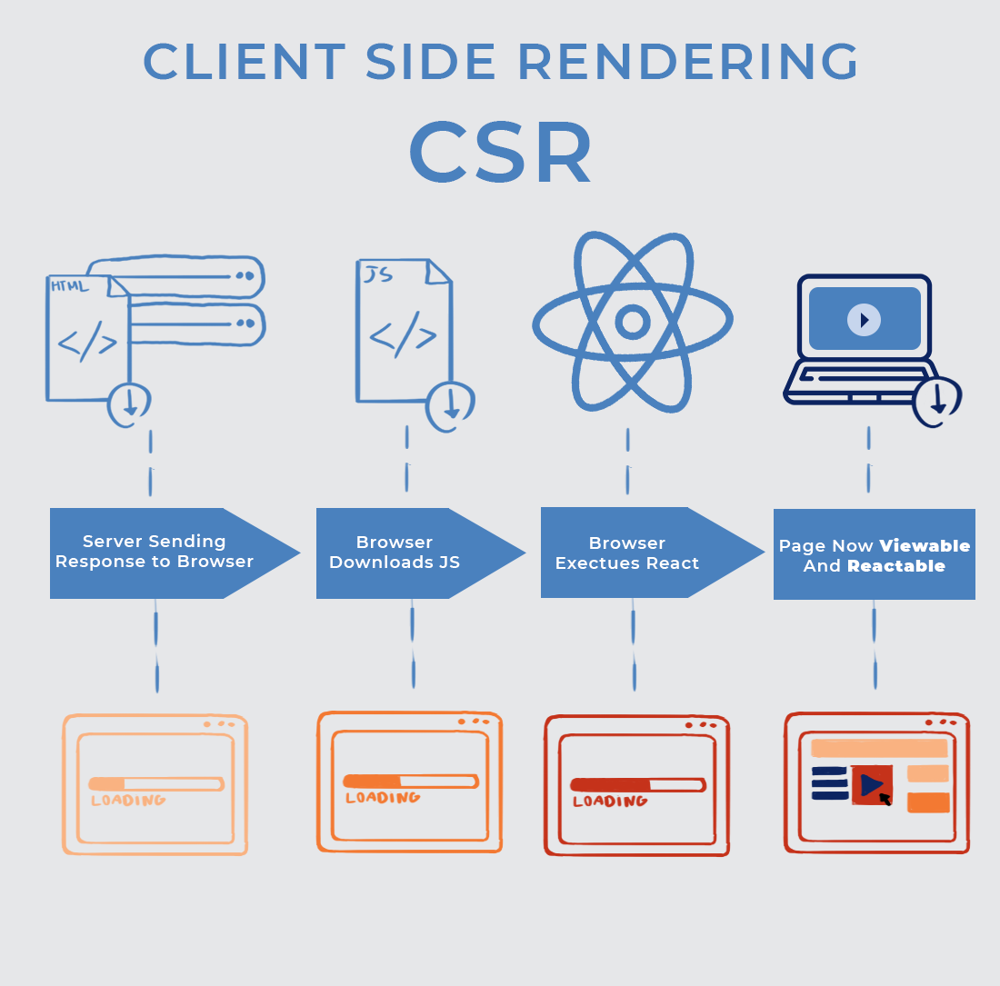
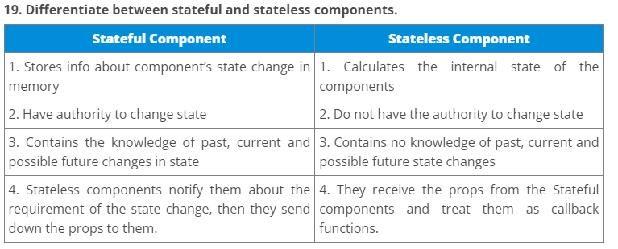
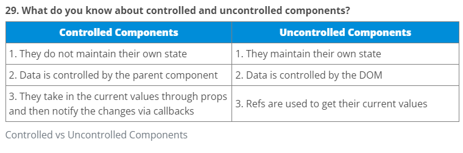
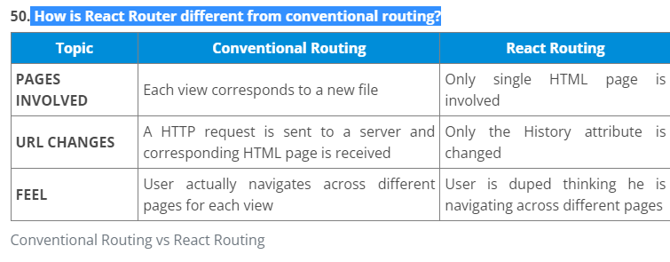

## INTERVIEW: https://www.interviewbit.com/react-interview-questions/

## Without JSX?

- SRC:- https://codesandbox.io/s/withoutjsx-2ib9um?file=/src/index.js

## What is SSR AND CSR?

- https://kruschecompany.com/ssr-or-csr-for-progressive-web-app/#SSR_vs_CSR_-_whats_the_difference_and_why_does_it_matter
  
  
   

## Stateful vs StateLess

## What do you know about controlled and uncontrolled components?

## How is React Router different from conventional routing?

## life cycle of useState;
https://blog.devgenius.io/react-hooks-tutorial-usestate-and-lifecycle-5618ecbb37ab