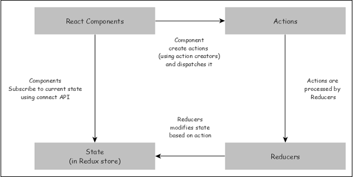

# 1. What is Redux?

src:- https://www.tutorialspoint.com/reactjs/reactjs_redux.htm

- Child to Parent state management is difficult.
- React redux is an advanced state management library for React. As we learned earlier, React only supports component level state management. In a big and complex application, large number of components are used. React recommends to move the state to the top level component and pass the state to the nested component using properties. It helps to some extent but it becomes complex when the components increases.

- React redux chips in and helps to maintain state at the application level. React redux allows any component to access the state at any time. Also, it allows any component to change the state of the application at any time.

## Store

- The central place to store the state of the application.
- The Redux store is the main, central bucket which stores all the states of an application. It should be considered and maintained as a single source of truth for the state of the application.

- If the store is provided to the App.js (by wrapping the App component within the <Provider> </Provider> tag) as shown in the code snippet below, then all its children (children components of App.js) can also access the state of the application from the store. This makes it act as a global state.
  

## 2 . What are actions?

src:- https://www.freecodecamp.org/news/what-is-redux-store-actions-reducers-explained/

- Action is an plain object with the type of the action to be done and the input (called payload) necessary to do the action. For example, action for adding an item in the store contains ADD_ITEM as type and an object with item’s details as payload. The action can be represented as −

```javascript
{
   type: 'ADD_ITEM',
   payload: { name: '..', ... }
}
```

- Every action must have at least a type associated with it. Any other detail that needs to be passed is optional and will depend on the type of action we dispatch.

```javascript
// Action that got created by the action creator addItemToCart()

{
    type: "ADD_ITEM_TO_CART" // Note: Every action must have a type key
    payload: {
        bookName: "Harry Potter and the Goblet of Fire",
        noOfItem: 1,
    }
}
```

# 3. What are reducers?

- Reducers are pure functions used to create a new state based on the existing state and the current action. It returns the newly created state. For example, in add item scenario, it creates a new item list and merges the item from the state and new item and returns the newly created list.

## Default in reducer

Note that the state parameter is a default parameter which accepts an initial state. This is to handle the scenario when the reducer is called for the first time when the state value is undefined.

# 4. What are action creators?

- Action creator creates an action with proper action type and data necessary for the action and returns the action. For example, addItem action creator returns below object −

```javascript
{
   type: 'ADD_ITEM',
   payload: { name: '..', ... }
}
```

## Component

- Component can connect to the store to get the current state and dispatch action to the store so that the store executes the action and updates it’s current state.

The workflow of a typical redux store can be represented as shown below.



- React component subscribes to the store and get the latest state during initialization of the application.
- To change the state, React component creates necessary action and dispatches the action.
- Reducer creates a new state based on the action and returns it. Store updates itself with the new state.

## Provider component

# 1. What is the use of Provider?

- React Redux provides a Provider component and its sole purpose to make the Redux store available to its all nested components connected to store using connect API. The sample code is given below −

```javascript
import React from "react";
import ReactDOM from "react-dom";
import { Provider } from "react-redux";
import { App } from "./App";
import createStore from "./createReduxStore";

const store = createStore();

ReactDOM.render(
  <Provider store={store}>
    <App />
  </Provider>,
  document.getElementById("root")
);
```

- Now, all the component inside the App component can get access to the Redux store by using connect API.

# 5. What are dispatchers?

- Dispatch(action)​ Dispatches an action. This is the only way to trigger a state change. The store's reducing function will be called with the current getState() result and the given action synchronously.

# 6. What are pure functions?

src:- https://www.geeksforgeeks.org/pure-functions-in-javascript/

# 7. Why do we spread the state or return a new object in reducers?

- state in redux is immutable. So, the reducers make a copy of the entire current state first, make the necessary changes, and then return a fresh new instance of the state – with all the necessary changes/ updates.

- So in the above example, we first make a copy of the entire state using the spread operator ...state. Then we increment the noOfItemInCart by 1, update the cart array by adding the new object passed in the action.payload shown below, and then finally return the updated object.
- By creating a new object, it's no longer the current actual state. You can mutate your new object all you like. Upon returning it, Redux will replace the entire current state with the entire new state.

# 8. Why is redux state immutable?

SRC:- https://supertokens.com/blog/why-is-redux-state-immutable

example = [label](stateImmutable.js)

# 9. Why do dispatchers take only actions which are objects

# 10. What are types in actions why do we need them?

- Explained with examples

# 11. What happens when you pass a function into a dispatcher?

# 12. Where do dispatchers come from?

# 13. What are the properties of a store?

# 14. Can you create your own redux and create the following methods?

dispatchers
constructor
getState
subscribe

# 15. Explain redux to a 5 year old?

src:- https://saranjeetgrewal.medium.com/teach-redux-to-5-years-old-11adb6900576

# 16. What is the difference between Context API and Redux?

# 17. What are redux thunks?

Redux Thunks are a middleware for Redux, a popular state management library for JavaScript applications. Thunks are functions that allow us to perform asynchronous logic, such as fetching data from an API or dispatching multiple actions in sequence, inside a Redux action creator.

The main reason to use Redux Thunks is to handle asynchronous actions in Redux. Redux is designed to handle synchronous actions, which means that it cannot directly handle asynchronous logic like making an API call or dispatching multiple actions in sequence. Thunks allow us to handle asynchronous logic outside of the Redux store, but still keep it within the Redux architecture.

By using Redux Thunks, we can write actions that can dispatch multiple actions in sequence, perform side effects, and make API requests. It allows us to write clean and maintainable code by separating the logic for handling the asynchronous operation from the logic for updating the Redux store.

To use Redux Thunks, we need to install the redux-thunk middleware and apply it to the store. Once we have done this, we can create thunk action creators that return a function instead of an action object. Inside the function, we can perform any asynchronous logic we need to, and then dispatch one or more actions to update the Redux store.

Overall, Redux Thunks are a powerful tool for handling asynchronous actions in Redux, and they are widely used in Redux-based applications to manage complex state and data flow.

- Redux Thunk acts as a middleware that will return you a function instead of an object while calling through the action creators. The returned function receives the dispatch method from the store and then later it is used to dispatch synchronously inside the body of function once the asynchronous actions have been completed.
- https://www.geeksforgeeks.org/what-is-the-use-of-middleware-redux-thunk/
- https://medium.com/@istvanistvan/why-use-redux-thunk-1ca326d6a46

# 18. Why do we need to use network requests in redux thunks?

# 19. What are middlewares?

# 20. Can you write your own middleware instead of thunks? what do thunks do?

# 21. Explain with a diagram how state gets updated with redux?

# 22. What is useSelector?

- hooks in redux
- useSelector() ​ Allows you to extract data from the Redux store state, using a selector function.

# 23. What is the compareFn that you pass in a useSelector?

# 24. What is useDispatch?

- hook in redux
  This hook returns a reference to the dispatch function from the Redux store. You may use it to dispatch actions as needed

# 25. what is redux tool kit? How does it make redux better?

# 26. What is flux architecture

https://www.geeksforgeeks.org/redux-and-the-flux-architecture/
